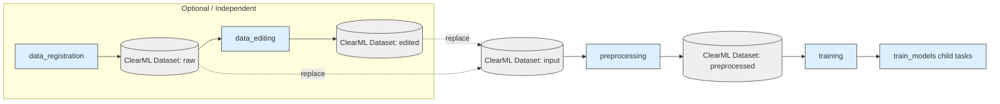
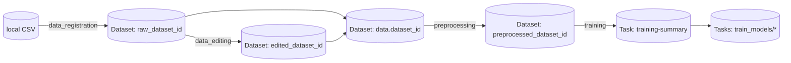

# README_dev.md

本ドキュメントは `automl_lib` を拡張・保守する開発者向けガイドです。  
「各フェーズ単独実行」「ClearML と連動したデータ/タスク管理」「後からモデルや処理を追加しやすい構成」を前提に、実装方針・入出力仕様・設定スキーマ・拡張ポイントをまとめます。

---

## 0. まず結論（開発者向けの運用最小セット）

- 実行は基本 `./.venv/bin/python -m automl_lib.cli.<command>` を使う（環境によって `python` が無い前提のため）
- データは原則 ClearML Dataset ID を入力として使う（`data.dataset_id`）
- 個別フェーズの I/O は `automl_lib/types/phase_io.py` の構造に合わせる
  - `DatasetInfo`（dataset/task/csv の受け渡し）
  - `TrainingInfo`（training summary の受け渡し）
  - `InferenceInfo`（推論フェーズ結果）
- PipelineController 実行中（`AUTO_ML_PIPELINE_ACTIVE=1`）は「step task を close しない」
  - step wrapper が戻り値/Artifactsを書き戻すため、早期 close で競合しやすい

---

## 1. ディレクトリ構成（開発者が触る場所）

```
automl_lib/
  cli/                # フェーズ単独実行 CLI（run_*.py）
  integrations/        # 外部連携（ClearML等）
  config/              # pydantic スキーマ & loader（schemas.py/loaders.py）
  data/                # データ型推定など
  workflow/            # 各フェーズ（processing/meta/visualization/clearml_integration）
  pipeline/            # PipelineController（ClearML）
  preprocessing/       # 前処理パイプライン生成（ColumnTransformer）
  registry/            # models/metrics/preprocessors の登録（拡張ポイント）
  training/            # 学習（探索/評価/可視化/解釈/clearml管理）
  types/               # フェーズ間I/Oモデル（DatasetInfo/TrainingInfo/InferenceInfo）
```

補足:

- 本リポジトリは `automl_lib/` と実行に必要な設定/テストのみを同梱します（旧実装は含みません）

---

## 2. 環境構築（開発者）

### 2.1 Python / venv

```bash
python3 -m venv .venv
source .venv/bin/activate
pip install -r requirements.txt
# 任意（Optuna/SHAP/LightGBM/TabPFN など）
pip install -r requirements-optional.txt
```

補足:

- `pydantic` は必須（設定バリデーションに使用）
- `clearml` は必須（ClearML連携/ローカルPipelineControllerに使用）
- `optuna` は `optimization.method=bayesian` 等で利用（無い場合は該当機能が落ちる）
- `shap` は解釈で optional（無い場合は SHAP を skip）

### 2.2 ClearML 設定

- `clearml.conf.example` を `clearml.conf` にコピーし、URL / 認証情報を設定してください。
  - `automl_lib/integrations/clearml/bootstrap.py` が（`clearml.conf` が存在すれば）自動で `CLEARML_CONFIG_FILE` を設定します。

### 2.3 ClearML サーバ

- ClearML サーバは別途用意してください（SaaS / 既存環境 / 自前ホスト）。
- サーバ側障害（Elasticsearch等）でログ送信が落ちる場合は、サーバログ/リソース状況を確認してください。

---

## 3. 実行コマンド（開発・検証用）

### 3.0 Hydra/OmegaConf（設定の合成・上書き）

Hydra の設定は `conf/` 配下にあります。`run_*_hydra` は Hydra で compose した設定を
解決済み YAML として保存してから既存の処理を呼び出します（挙動を変えずに設定管理だけ置き換える目的）。

```bash
# 単独フェーズ（root keys で上書き）
./.venv/bin/python -m automl_lib.cli.run_training_hydra data.dataset_id=<DATASET_ID>
./.venv/bin/python -m automl_lib.cli.run_preprocessing_hydra data.dataset_id=<DATASET_ID>
./.venv/bin/python -m automl_lib.cli.run_inference_hydra model_id=<MODEL_ID>

# pipeline（phase prefix で上書き）
./.venv/bin/python -m automl_lib.cli.run_pipeline_hydra training.data.dataset_id=<DATASET_ID>
```

ClearML では各タスクの `Configuration Objects` に `OmegaConf` として保存されます（実行時の最終設定）。

### 3.1 フェーズ単独実行（推奨）

```bash
# 1) data_registration（CSV -> ClearML Dataset）
./.venv/bin/python -m automl_lib.cli.run_data_registration \
  --config config_dataregit.yaml \
  --output-info outputs/datareg_info.json

# 2) data_editing（Dataset/CSV -> 編集 -> ClearML Dataset）
./.venv/bin/python -m automl_lib.cli.run_data_editing \
  --config config_editing.yaml \
  --input-info outputs/datareg_info.json \
  --output-info outputs/editing_info.json

# 3) preprocessing（既存Dataset -> 前処理 -> ClearML Dataset）
./.venv/bin/python -m automl_lib.cli.run_preprocessing \
  --config config_preprocessing.yaml \
  --output-info outputs/preprocessing_info.json

# 4) training（Dataset/CSV -> 学習/探索 -> summary + child tasks）
./.venv/bin/python -m automl_lib.cli.run_training \
  --config config_training.yaml \
  --input-info outputs/preprocessing_info.json \
  --output-info outputs/training_info.json

# 5) inference（学習済みモデルで推論/探索）
./.venv/bin/python -m automl_lib.cli.run_inference \
  --config inference_config.yaml \
  --output-info outputs/inference_info.json
```

`--input-info` / `--training-info` は JSON/YAML の両対応です（`automl_lib/cli/common.py`）。

### 3.2 pipeline 実行（ClearML PipelineController のみ）

```bash
# ClearML PipelineController（ClearML無効の場合は失敗）
./.venv/bin/python -m automl_lib.cli.run_pipeline --config config.yaml --mode clearml --output-info outputs/pipeline_clearml.json

# 任意: pipeline 前段で data_registration / data_editing を走らせたい場合
# - `--datareg-config` / `--editing-config` で専用YAMLを指定可能（省略時は `config_dataregit.yaml` / `config_editing.yaml` を自動検出）
# - `--preproc-config` も指定可能（省略時は `config_preprocessing.yaml` を自動検出）
# - `--inference-config` も指定可能（省略時は `inference_config.yaml` を自動検出、`clearml.enable_inference: true` のときのみ実行）
# - dataset_id が無い場合でも、前段が有効なら dataset_id を生成して preprocessing に渡す
./.venv/bin/python -m automl_lib.cli.run_pipeline \
  --config config_from_csv.yaml \
  --mode clearml \
  --datareg-config config_dataregit.yaml \
  --editing-config config_editing.yaml \
  --preproc-config config_preprocessing.yaml \
  --inference-config inference_config.yaml \
  --output-info outputs/pipeline_from_csv.json
```

### 3.3 テスト（最小単体テスト）

```bash
./.venv/bin/python -m unittest discover -s tests -v
```

未使用コードの洗い出し/削除手順は `docs/CLEANUP.md` を参照してください。
（CLI/pipeline の代表経路まで coverage を広げたい場合は `scripts/coverage_entrypoints_smoke.py` を `--coverage-cmd` で追加します）

ClearML 上の P0 受け入れ確認（training-summary の Plots が 01–08 のみ）:

```bash
./.venv/bin/python scripts/verify_clearml_training_summary_plots.py --config config.yaml
```

ClearML 上の P0 受け入れ確認（enable_inference=true 時の inference 親子タスク/Artifacts）:

```bash
./.venv/bin/python scripts/verify_clearml_inference_pipeline.py --config config.yaml --inference-config inference_config.yaml
```

---

## 4. フェーズI/O仕様（統一ルール）

### 4.1 目的

- フェーズ間の受け渡しを「最低限の共通構造」に固定して、後からフェーズを差し替え・追加しやすくします。
- CLI の `--output-info` をそのまま次フェーズの `--input-info` に渡せるようにします。

### 4.2 I/Oモデル（コード）

- `automl_lib/types/phase_io.py`
  - `DatasetInfo`: `dataset_id`, `task_id`, `csv_path`
  - `TrainingInfo`: `dataset_id`, `task_id`, `training_task_ids`, `metrics?`
  - `InferenceInfo`: `task_id`, `child_task_ids`, `output_dir`, `artifacts[]`, `mode`

### 4.3 フェーズ別の入出力（開発者が守ること）

| フェーズ | 入力 | 出力 | 備考 |
|---|---|---|---|
| data_registration | `config_dataregit.yaml`（`data.csv_path`） | `DatasetInfo` | 重複は CSV hash で検出し再利用 |
| data_editing | `config_editing.yaml` + `DatasetInfo?(任意)` | `DatasetInfo` | 編集後CSV hash で重複検出し再利用 |
| preprocessing | `config_preprocessing.yaml`（または `config.yaml`） + `DatasetInfo?(任意)` | `DatasetInfo` | **入力は既存ClearML Dataset ID が基本** |
| training | `config_training.yaml`（または `config.yaml`） + `DatasetInfo?(任意)` | `TrainingInfo` | summary task + train_models 子タスク群 |
| inference | `inference_config.yaml` | `InferenceInfo` | 予測結果のCSV/画像パス・ClearML task id を返す |

統一ルール（重要）:

- `dataset_id` は **ClearML Dataset ID（32桁hex）** を入れる
- `task_id` は「そのフェーズの代表タスク（親）」を入れる（child task 群がある場合も親を入れる）
- 追加フィールドを増やす場合は `automl_lib/types/` に型を追加してから使う

---

## 5. 設定ファイル仕様（pydantic スキーマ基準）

### 5.1 スキーマ対応表

| ファイル | スキーマ | 用途 |
|---|---|---|
| `config.yaml` | `TrainingConfig` | training / pipeline の基本設定（preprocessing等も含む） |
| `config_dataregit.yaml` | `DataRegistrationConfig` | data_registration 単独 |
| `config_editing.yaml` | `DataEditingConfig` | data_editing 単独 |
| `config_preprocessing.yaml` | `PreprocessingConfig` | preprocessing 単独（`config.yaml` を渡してもOK） |
| `inference_config.yaml` | `InferenceConfig` | inference 単独 |

参照元:

- `automl_lib/config/schemas.py`
- `automl_lib/config/loaders.py`

### 5.2 共通: `data.*`（DataSettings）

| キー | 型 | 必須 | 使うフェーズ | 説明 |
|---|---:|:---:|---|---|
| `data.dataset_id` | `str?` | △ | preprocessing/training/pipeline | 入力 ClearML Dataset ID（推奨） |
| `data.csv_path` | `str?` | △ | data_registration/data_editing/training(フォールバック) | ローカルCSV（Datasetが無い場合の代替） |
| `data.target_column` | `str?` | △ | preprocessing/training | 目的変数列（未指定時は末尾列） |
| `data.feature_columns` | `list[str]?` | ✗ | preprocessing/training | 特徴量列（未指定時は target 以外全部） |
| `data.problem_type` | `regression|classification|null` | ✗ | training | タスク種別（未指定は自動推定） |
| `data.test_size` | `float` | ✗ | training | holdout の割合（`[0,1)`） |
| `data.random_seed` | `int` | ✗ | training | 乱数seed |

必須条件（TrainingConfigのバリデーション）:

- `data.dataset_id` または `data.csv_path` のどちらかは必須

### 5.3 preprocessing: `preprocessing.*`（PreprocessSettings）

| キー | 型 | 使うフェーズ | 説明 |
|---|---:|---|---|
| `preprocessing.plugins` | `list[str]` | preprocessing/training | import するプラグインモジュール（import時に `register_preprocessor()` を呼ぶ） |
| `preprocessing.numeric_imputation` | `list[str|null]` | preprocessing/training | 数値欠損補完（`mean|median|most_frequent|null`） |
| `preprocessing.categorical_imputation` | `list[str|null]` | preprocessing/training | カテゴリ欠損補完（`most_frequent|null`） |
| `preprocessing.scaling` | `list[str|null]` | preprocessing/training | スケーリング（例: `standard|minmax|robust|null`） |
| `preprocessing.categorical_encoding` | `list[str|null]` | preprocessing/training | エンコード（例: `onehot|ordinal|null`） |
| `preprocessing.polynomial_degree` | `false or int>=2` | preprocessing/training | 多項式特徴量 |
| `preprocessing.target_standardize` | `bool` | training | 目的変数標準化（回帰のみ） |
| `preprocessing.numeric_pipeline_steps` | `list[{name, params}]` | preprocessing/training | 数値列に追加ステップ（registry 名で指定） |
| `preprocessing.categorical_pipeline_steps` | `list[{name, params}]` | preprocessing/training | カテゴリ列に追加ステップ（registry 名で指定） |

### 5.4 training: `models.*`（ModelSpec）

| キー | 型 | 必須 | 説明 |
|---|---:|:---:|---|
| `models[].name` | `str` | ✓ | モデル名（registryで解決。大小/空白/ハイフン差異は吸収） |
| `models[].enable` | `bool` | ✗ | 有効/無効 |
| `models[].params` | `dict` | ✗ | ハイパラ（grid 等は list を入れる） |

必須条件（TrainingConfigのバリデーション）:

- `models` は非空
- `models[].enable=true` が1つ以上

### 5.5 training: `ensembles.*`

| キー | 型 | 説明 |
|---|---:|---|
| `ensembles.stacking.enable` | `bool` | stacking を作るか |
| `ensembles.stacking.estimators` | `list[str]` | stacking の base estimator 名 |
| `ensembles.stacking.final_estimator` | `str?` | final estimator 名 |
| `ensembles.voting.enable` | `bool` | voting を作るか |
| `ensembles.voting.estimators` | `list[str]` | voting 対象 |
| `ensembles.voting.voting` | `str?` | `hard|soft` 等 |

### 5.6 training: `cross_validation.*`

| キー | 型 | 説明 |
|---|---:|---|
| `cross_validation.n_folds` | `int?` | `>=2` / null なら自動 |
| `cross_validation.shuffle` | `bool` | 分割時に shuffle するか |
| `cross_validation.random_seed` | `int` | CV 用seed |

### 5.7 output: `output.*`

| キー | 型 | 使うフェーズ | 説明 |
|---|---:|---|---|
| `output.output_dir` | `str` | training | 出力ディレクトリ（モデル/結果/ログ） |
| `output.save_models` | `bool` | training | モデル保存 |
| `output.generate_plots` | `bool` | training | 可視化生成 |
| `output.results_csv` | `str` | training | 結果CSV名 |

preprocessing の出力ディレクトリ:

- preprocessing: `outputs/preprocessing`（デフォルト）  
  - 変更したい場合は `config_preprocessing.yaml` の `output.output_dir` を使う

### 5.8 evaluation: `evaluation.*`

| キー | 型 | 説明 |
|---|---:|---|
| `evaluation.plugins` | `list[str]` | importする評価プラグイン（import時に `register_metric()` など） |
| `evaluation.regression_metrics` | `list[str]` | 回帰メトリクス名 |
| `evaluation.classification_metrics` | `list[str]` | 分類メトリクス名 |
| `evaluation.primary_metric` | `str?` | 最良モデル選択の指標（nullはデフォルト） |

### 5.9 optimization: `optimization.*`

| キー | 型 | 説明 |
|---|---:|---|
| `optimization.method` | `grid|random|bayesian` | 探索方式 |
| `optimization.n_iter` | `int>=1` | random/bayesian の試行回数 |

### 5.10 interpretation / visualizations

| キー | 型 | 説明 |
|---|---:|---|
| `interpretation.compute_feature_importance` | `bool` | 重要度計算 |
| `interpretation.compute_shap` | `bool` | SHAP計算（`shap` optional） |
| `visualizations.predicted_vs_actual` | `bool` | 予測vs実測 |
| `visualizations.residual_scatter` | `bool` | 残差散布図 |
| `visualizations.residual_hist` | `bool` | 残差ヒストグラム |
| `visualizations.feature_importance` | `bool` | 重要度プロット |
| `visualizations.shap_summary` | `bool` | SHAP summary |
| `visualizations.comparative_heatmap` | `bool` | 比較ヒートマップ |

### 5.11 ClearML: `clearml.*`（主なキー）

| キー | 型 | 説明 |
|---|---:|---|
| `clearml.enabled` | `bool` | ClearML 連携を使うか |
| `clearml.project_name` | `str?` | タスクを作るプロジェクト名 |
| `clearml.dataset_project` | `str?` | Dataset を登録するプロジェクト名 |
| `clearml.base_output_uri` | `str?` | Dataset/Artifacts の出力先（S3等） |
| `clearml.task_name` | `str?` | pipeline/training summary のタスク名 |
| `clearml.queue` | `str?` | デフォルト実行キュー |
| `clearml.services_queue` | `str?` | PipelineController 等サービス用途キュー |
| `clearml.tags` | `list[str]` | タスク/データセットに付けるタグ |
| `clearml.run_tasks_locally` | `bool` | agentが無い環境でもローカルで進める（fallback用） |
| `clearml.run_pipeline_locally` | `bool` | PipelineController をローカルで動かす |
| `clearml.raw_dataset_id` | `str?` | 入力 raw Dataset ID |
| `clearml.edited_dataset_id` | `str?` | 入力 edited Dataset ID |
| `clearml.preprocessed_dataset_id` | `str?` | 入力 preprocessed Dataset ID |
| `clearml.register_raw_dataset` | `bool` | data_registration を実行/登録するか |
| `clearml.enable_data_editing` | `bool` | pipeline で data_editing を有効にする（将来拡張用） |
| `clearml.enable_preprocessing` | `bool` | preprocessing を有効化 |
| `clearml.enable_training` | `bool` | training を有効化 |
| `clearml.enable_inference` | `bool` | inference を有効化（将来） |
| `clearml.enable_optimization` | `bool` | optimization を有効化（将来） |
| `clearml.enable_pipeline` | `bool` | pipeline 実行を有効化 |
| `clearml.summary_plots` | `none|best|all` | training-summary の Plots に「推奨モデル(best)のみ」の結果（例: Pred vs True / PCA 等）を表示するか（`all` は互換用で best 扱い） |
| `clearml.recommendation_mode` | `auto|training` | 推奨モデルの選び方（auto推奨） |
| `clearml.agents.*` | `str?` | フェーズ別キュー（未設定は `clearml.queue` を利用） |

---

## 6. Mermaid: 全体フロー / フェーズフロー / ClearML受け渡し

### 6.1 全体フロー（推奨: registration/editing は独立、pipeline は preprocessing→training）



### 6.2 data_registration

```mermaid
flowchart TD
  A[config_dataregit.yaml<br/>data.csv_path] --> B[hash_tag_for_path]
  B --> C{同一hashのDatasetが存在?}
  C -- Yes --> D[既存 dataset_id を返す]
  C -- No --> E[Dataset.create/add_files/upload/finalize]
  E --> F[DatasetInfo(dataset_id, task_id, csv_path)]
```

### 6.3 data_editing

```mermaid
flowchart TD
  A[config_editing.yaml<br/>data.dataset_id or data.csv_path] --> B[Load DataFrame]
  B --> C[Apply editing rules<br/>drop/rename/query/clip/fillna]
  C --> D[Write edited.csv]
  D --> E[hash_tag_for_path(edited.csv)]
  E --> F{同一hashのDatasetが存在?}
  F -- Yes --> G[既存 dataset_id を返す]
  F -- No --> H[Dataset.create(parent=source)/add_files/upload/finalize]
  H --> I[DatasetInfo(dataset_id, task_id, csv_path)]
  G --> I
```

### 6.4 preprocessing（入力は既存Datasetを前提）

```mermaid
flowchart TD
  A[DatasetInfo or config_preprocessing.yaml<br/>data.dataset_id] --> B[Dataset.get_local_copy]
  B --> C[feature type inference]
  C --> D[generate_preprocessors]
  D --> E[fit_transform -> outputs/preprocessing/&lt;run_id&gt;/dataset/data_processed.csv<br/>(+ schema/manifest/recipe/summary/bundle)]
  E --> F[Dataset.create(parent=input)/add_files/upload/finalize]
  F --> G[DatasetInfo(preprocessed_dataset_id, task_id, csv_path)]
```

### 6.5 training（summary + train_models 子タスク）

```mermaid
flowchart TD
  A[config.yaml + DatasetInfo(dataset_id)] --> B[training-summary Task]
  B --> C[download Dataset (optional)]
  C --> D{preprocessing contract exists?}
  D -- Yes --> E[use identity preprocessor<br/>(avoid double preprocessing)]
  D -- No --> F[generate preprocessors]
  E --> G[model search/eval]
  F --> G
  G --> H[child task: train_<model>...]
  H --> I[metrics/models/artifacts]
  G --> J[summary aggregation]
  J --> K[TrainingInfo(task_id, training_task_ids, metrics)]
```

training-summary（親タスク）のUI契約（重要）:

- `Configuration > Hyperparameters` は「入力設定だけ」（巨大configはArtifactに保存）
- `Configuration > Configuration Objects` は「参照用」（`Dataset` / `Preprocessing` など）
- `Configuration > USER PROPERTIES` に `recommended_model_id` / `dataset_id` / `run_id` など短い要約を保存
- `Plots` は `01_Overview/*` と `02_Leaderboard/*` に集約（各モデルの詳細は子タスクへ）

### 6.7 ClearML上での受け渡し（IDの流れ）



### 6.8 inference（single/batch は単独、optimize は summary + Prediction_runs）

```mermaid
flowchart TD
  A[inference_config.yaml] --> C{mode}
  C -- single --> D[Task: infer single]
  C -- batch --> E[Task: infer batch]
  C -- optimize --> B[Task: inference-summary]
  B --> P[Tasks: Prediction_runs/* (predict rank:* all trials)]
  D --> G[Artifacts: input.json/output.json]
  E --> H[Artifacts: predictions.csv]
  B --> I[Artifacts: trials.csv/best_solution.json]
  P --> G
```

推論タスクのUI契約（重要）:

- `Configuration > Hyperparameters`
  - single: `Model` / `Input` / `SingleInput`
  - optimize: `Model` / `Input` / `Variables` / `Search`（TopK表示はここ。子タスクは全trial）
- `Configuration > Configuration Objects`: `OmegaConf` / `Model` / `Provenance`（学習/前処理/データセットの辿り）
- `Configuration > USER PROPERTIES`: `model_id` / `mode` / `prediction`（single）など短い要約

---

## 7. 拡張ポイント（どこを追加/修正すべきか）

### 7.1 新しい前処理ステップを追加したい

- 追加先（推奨）: `automl_lib/registry/preprocessors.py`
  - `register_preprocessor("my_step", builder, aliases=[...])`
- 設定での指定:
  - `preprocessing.numeric_pipeline_steps` / `preprocessing.categorical_pipeline_steps`
  - `preprocessing.plugins` にプラグインmodule名を追加（import時に登録する）
- 実装の中心:
  - パイプライン生成: `automl_lib/preprocessing/preprocessors.py`

### 7.2 新しい評価指標（metric）を追加したい

- 追加先:
  - `automl_lib/registry/metrics.py`（標準に含める場合）
  - または プロジェクト固有の任意の module（例: `your_project.automl_plugins.metrics`）
- 設定での指定:
  - `evaluation.plugins` にプラグイン module 名を追加
  - `evaluation.regression_metrics` / `evaluation.classification_metrics` に metric 名を追加
- scorer callable にも対応（例: `sklearn.metrics.make_scorer`）

### 7.3 新しいモデルを追加したい

- 追加先:
  - `automl_lib/registry/models.py`
    - `register_model("MyModel", regressor=..., classifier=..., aliases=[...])`
- 学習側の解決:
  - `automl_lib/training/model_factory.py` が registry から解決

### 7.4 新しいフェーズを追加したい（将来の推奨構成）

追加するディレクトリ:

```
automl_lib/workflow/<new_phase>/
  processing.py
  clearml_integration.py
  meta.py              # メタ情報（構造化ログ/JSON）
  visualization.py     # 可視化（plots/artifacts）
```

追加するエントリ:

- CLI: `automl_lib/cli/run_<new_phase>.py`
- exports: `automl_lib/workflow/__init__.py`
- pipeline: `automl_lib/pipeline/controller.py` に step 追加（必要なら）
- config:
  - `automl_lib/config/schemas.py` に専用Configを追加
  - `automl_lib/config/loaders.py` に loader を追加

### 7.5 ClearMLログ/Artifacts/Plotsを増やしたい

- `automl_lib/integrations/clearml/logging.py` の薄いラッパを使う（`report_table`, `report_plotly`, `upload_artifacts`）
- 各フェーズの `clearml_integration.py` / `processing.py` に集約して呼ぶ

---

## 8. 既知の残件 / 次の開発項目（ロードマップ）

完了:

- ✅ inference のI/O統一（`InferenceInfo` + `--output-info`）
- ✅ TrainingConfig のモデル名バリデーション（`models[].name` を早期検知）
- ✅ 旧 `automl_core` の削除（`automl_lib` に集約）
- ✅ pipeline に data_registration/data_editing を step として統合（任意）
- ✅ フェーズ別configの分離（`config_training.yaml` / `config_preprocessing.yaml`）
- ✅ 出力ディレクトリの統一（preprocessing: `outputs/preprocessing`、training: `outputs/train`、data_editing: `outputs/data_editing`）
- ✅ 最小単体テスト追加（config loaders / schemas / registry / phase I/O）
- ✅ テスト拡張（CLI / pipeline / phase processing のスモークテスト）
- ✅ `automl_lib/workflow/__init__.py` を lazy import 化（起動高速化・不要依存の回避）
- ✅ comparison フェーズの削除（training-summary の recommendation/leaderboard に集約）

次の優先度（高→低）:

1. **E2Eスモーク（任意）**（ClearML有効で pipeline を最小データで1周させる/CI整備）
2. **拡張ポイントの固定化**（前処理/モデル/指標/可視化/プロパティ付与の編集箇所を一意にする）

---

## 9. トラブルシュート（開発者）

### 9.1 ClearMLが `events.add_batch` で落ちる

- サーバ側（Elasticsearch 等）の障害/メモリ不足の可能性があります
- ClearML サーバのログとリソース状況（メモリ/ディスク）を確認してください

### 9.2 PipelineController ローカル実行で task close 周りが不安定

- `AUTO_ML_PIPELINE_ACTIVE=1` の間は step task を close しない（`flush(wait_for_uploads=True)` のみ）

### 9.3 警告ログがうるさい

- 既定で抑制しています。戻す場合:
  - `AUTO_ML_SUPPRESS_WARNINGS=0`

---

## 10. 現状整理（開発者向けテーブル）

### 10.1 保守・改良しやすくするための工夫（設計/実装パターン）

| 工夫（観点） | 内容（何をしているか） | 効果 | 該当部（主なファイル） | 利用ライブラリ/機能 |
|---|---|---|---|---|
| フェーズ責務の分離 | `workflow/<phase>/processing.py` を “実処理の入口” にし、CLI/PIPELINE から同じ処理を呼ぶ | 単独実行とPipelineの差分を減らし、拡張ポイントを一意化 | `automl_lib/workflow/*/processing.py`<br>`automl_lib/cli/run_*.py`<br>`automl_lib/pipeline/controller.py` | Python（モジュール分割）<br>ClearML PipelineController（任意） |
| フェーズI/Oの型固定 | `DatasetInfo/TrainingInfo/InferenceInfo` を pydantic で型定義し、phase間の受け渡しを固定 | 追加項目の増減を “型” で管理でき、仕様差分が追いやすい | `automl_lib/types/phase_io.py` | `pydantic` |
| “設定はスキーマで守る” | configを pydantic で validate（`extra="forbid"`）し、間違ったキー/型を早期に落とす | ユーザー/開発者の誤設定を早期検知し、暗黙挙動を減らす | `automl_lib/config/schemas.py` | `pydantic` |
| config ローダの統一 | YAML読み込み→pydantic validate を loader に集約 | 入口が増えても読み込み/validateがブレない | `automl_lib/config/loaders.py` | `PyYAML` |
| Hydraでの設定合成（互換運用） | `conf/` の Hydra compose → 解決済み YAML を保存して既存処理を呼ぶ | 既存挙動を変えずに “設定管理だけ” 差し替えできる | `automl_lib/cli/run_*_hydra.py`<br>`conf/` | `hydra` / `omegaconf` |
| registryによる拡張点の一意化 | モデル/指標/前処理ステップを registry に登録し、処理側は registry から解決 | “どこに追加すれば良いか” が明確になり、横展開が容易 | `automl_lib/registry/models.py`<br>`automl_lib/registry/metrics.py`<br>`automl_lib/registry/preprocessors.py` | Python（registry/alias） |
| plugin import で任意拡張 | `preprocessing.plugins` / `evaluation.plugins` で module を import して登録を発火 | プロジェクト固有の拡張を本体に混ぜずに追加できる | `automl_lib/config/schemas.py`（plugins項目） | Python import |
| ClearML “共通基盤” の分離 | Task/Dataset/tags/properties/hyperparams 等の共通ロジックを `integrations/clearml/` に集約 | phase側は “何を出すか” に集中でき、挙動の一貫性が出る | `automl_lib/integrations/clearml/*` | `clearml` |
| ClearML無効/未導入でも動く | ClearMLが無い/disabled の場合は no-op として処理を継続 | ローカル検証や依存の段階導入が容易 | `automl_lib/integrations/clearml/manager.py` | optional dependency pattern |
| Task再利用の混線防止 | `reuse_last_task_id=False` + `CLEARML_TASK_ID` のクリア（条件付き） | “タスクが増えない/上書きされる” 事故を減らす | `automl_lib/integrations/clearml/manager.py`<br>`automl_lib/cli/common.py::clearml_avoid_task_reuse`<br>`automl_lib/pipeline/controller.py` | `clearml` |
| HyperParametersの最小化（section化） | `task.connect(..., name=section)` を使い、入力に必要な辞書だけを section ごとに登録 | “関係ない設定が大量に出る” 汚染を抑制し、UIが読みやすい | `automl_lib/integrations/clearml/logging.py::report_hyperparams_sections`<br>`automl_lib/workflow/*`（connect箇所） | `clearml` |
| clone→編集→run を成立させる | 実行中タスクの HyperParameters を取得し、phase関連キーだけ config に適用 | ClearML UI で編集→再実行の導線が作れる | `automl_lib/integrations/clearml/hyperparams.py` | `clearml` |
| full config は Artifact/Configuration Objects へ | “参照用の完全config” は YAML として保存し、UIは最小入力だけ見せる | UI汚染を避けつつ、再現性/監査性を確保 | `automl_lib/workflow/training/clearml_summary.py::persist_full_config`<br>`automl_lib/workflow/data_registration/processing.py` | `PyYAML` / `clearml` |
| run_idで出力をスコープ | `outputs/<phase>/<run_id>/...` を基本にして上書きを防ぐ | 同一環境での多回実行でも成果物が混線しにくい | `automl_lib/integrations/clearml/context.py::run_scoped_output_dir` | `pathlib` |
| 命名/タグの規約化 | `run:<run_id>` `phase:<phase>` `dataset:<dataset_key>` を基本に、task/dataset name を統一 | 検索・列表示で run を追いやすい | `automl_lib/integrations/clearml/naming.py`<br>`automl_lib/integrations/clearml/context.py` | `clearml` |
| ClearML name の regex 事故回避 | ClearML が name filter を regex 扱いする前提で `sanitize_name_token` を利用 | “特殊文字でタスクが見つからない/落ちる” を回避 | `automl_lib/integrations/clearml/context.py::sanitize_name_token`<br>`automl_lib/pipeline/controller.py` | `re` |
| 前処理Dataset契約（contract） | `schema.json/manifest.json/preprocessing/*` を Dataset に同梱 | train/infer の整合と provenance が取りやすい | `automl_lib/workflow/preprocessing/meta.py`<br>`automl_lib/workflow/preprocessing/processing.py` | `joblib` / `pandas` |
| 学習時の二重前処理を回避 | preprocessed dataset contract を検出した場合は identity として扱う | “前処理を2回かけて崩れる” を避ける | `automl_lib/workflow/training/dataset_sources.py`<br>`automl_lib/workflow/training/runner.py` | `pandas` / `joblib` |
| “親は要約、子は詳細” のUI設計 | training-summary は比較/推奨に限定、詳細可視化は子タスクへ集約 | Plots爆発を防ぎ、ユーザーの見る場所が固定化する | `automl_lib/workflow/training/summary_plots.py`<br>`automl_lib/workflow/training/model_tasks.py` | `clearml` / `plotly`（任意） |
| verify scripts によるUI回帰検知 | ClearML上の Plots/HyperParameters 構造を機械検証する | UI規約の回帰を早期に検知できる | `scripts/verify_clearml_training_summary_plots.py`<br>`scripts/verify_clearml_inference_pipeline.py` | `clearml`（サーバ必要） |
| Dataset内のCSV選択の安全策 | `data_processed.csv` を優先する等、Dataset内の誤ったCSV選択を避ける | 親Datasetの raw CSV を誤って読む事故を減らす | `automl_lib/integrations/clearml/datasets.py::find_first_csv` | `pathlib` |
| 推論時の provenance/lineage 収集 | training-summary / dataset manifest から provenance を組み立てる | “どの学習結果から推論したか” を追跡可能 | `automl_lib/workflow/inference/provenance.py`<br>`automl_lib/workflow/inference/runner.py` | `clearml` / `json` |
| ログ/警告のノイズ抑制 | SSL警告や非本質warningを抑制（opt-out可） | ローカル開発のログが読みやすい | `automl_lib/integrations/clearml/bootstrap.py` | `warnings` / `logging` |

### 10.2 ClearML連携の整理（処理/タスク別）

| 処理/タスク | 内容（該当処置部） | ClearMLの役割（機能） | ClearML側で管理する効果 | 主な実装箇所 |
|---|---|---|---|---|
| pipeline（Controller task） | preprocessing→training→(inference) を DAG で接続（必要なら data_registration/data_editing も接続） | PipelineController / step task / queue制御 | run単位の可視化（DAG）と再実行性 | `automl_lib/pipeline/controller.py` |
| data_registration | ローカルCSVを Dataset として登録（hashで重複検出し再利用） | Dataset.create/upload/finalize / tags | データのバージョン管理・共有・再利用 | `automl_lib/workflow/data_registration/processing.py`<br>`automl_lib/integrations/clearml/datasets.py` |
| data_editing | Dataset/CSV を編集し、新 Dataset として登録（編集内容も出力） | Dataset / Task（編集ログ） | “編集済みデータ” の再現/監査 | `automl_lib/workflow/data_editing/processing.py` |
| preprocessing | 入力 Dataset を前処理し、preprocessed Dataset を登録（contract同梱） | Dataset / Task / Artifact | 前処理の再現性、train/infer の整合 | `automl_lib/workflow/preprocessing/processing.py`<br>`automl_lib/workflow/preprocessing/meta.py` |
| preprocessed-dataset（Datasetタスク） | Dataset task に前処理要約/設定/契約を持たせる（必要最小のHyperParameters/Configuration Objects） | Dataset内タスクの Configuration/Artifacts | “このDatasetがどう作られたか” を UI で追える | `automl_lib/integrations/clearml/datasets.py`（task.connect 等） |
| training-summary（親タスク） | 全モデルを集計し推奨モデル/leaderboard を提示（UIは要約に限定） | Task（HyperParams/Plots/Artifacts/Properties） | 非MLが “見るべき場所” を固定し判断できる | `automl_lib/workflow/training/runner.py`<br>`automl_lib/workflow/training/clearml_summary.py`<br>`automl_lib/workflow/training/summary_plots.py` |
| train_models/*（学習子タスク） | 1モデルの学習/評価/可視化/モデル登録（重いPlotsはここ） | Task.create / scalar/plot/artifact / OutputModel | 詳細分析の隔離、モデル登録（推論で再利用） | `automl_lib/workflow/training/model_tasks.py`<br>`automl_lib/integrations/clearml/manager.py` |
| Model Registry（OutputModel） | 学習子タスクが joblib を登録し model_id を発行 | OutputModel | 推論で model_id 指定が可能、成果物共有 | `automl_lib/integrations/clearml/manager.py::register_output_model` |
| inference single | 1条件の推論（input/output を artifact に保存、短い要約を properties に） | Task / Artifacts / User Properties | 推論の入力/出力の再現性 | `automl_lib/workflow/inference/runner.py` |
| inference batch | CSV等のバッチ推論（predictions.csv 等を artifacts に） | Task / Artifacts | バッチ結果の共有・再利用 | `automl_lib/workflow/inference/runner.py` |
| inference optimize（inference-summary） | 探索の要約（TopK/履歴/可視化/出力ファイル） | Task（親）/ Artifacts/Plots | “探索の結論” を要約タスクで確認できる | `automl_lib/workflow/inference/runner.py`<br>`automl_lib/workflow/inference/visualization.py` |
| Prediction_runs/*（optimize子タスク） | 各trialの条件/結果をログ（親から辿れる） | Task.create（子）/ parent link | trialが増えても要約と詳細を分離できる | `automl_lib/workflow/inference/runner.py::_create_child_task` |
| clone 実行（テンプレ複製） | template task を clone →（必要なら）enqueue、overrides を保存 | Task.clone / Configuration Objects | Python非ユーザー運用・テンプレ運用を支援 | `automl_lib/cli/run_clone.py`<br>`automl_lib/integrations/clearml/clone.py`<br>`automl_lib/integrations/clearml/overrides.py` |

### 10.3 ユーザー操作でブレる/問題が起き得る箇所と対策（実装ベース）

| ブレ/問題が起きる点 | 典型原因 | 対策（このプロジェクトの実装） | 効果 | 該当部（ファイル/設定） |
|---|---|---|---|---|
| Pipelineが動かない（キュー/agent） | queue未設定、agentがいないqueueにenqueue | pipeline起動時に queue/agent をチェックし、未設定は明示エラー | “なぜ動かないか” がすぐ分かる | `automl_lib/pipeline/controller.py` |
| タスクが増えない/上書きされる | ClearMLの task reuse / 既存 `CLEARML_TASK_ID` の影響 | `reuse_last_task_id=False` + `CLEARML_TASK_ID` クリア（条件付き） | 実行ごとに新規タスクが作られやすい | `automl_lib/integrations/clearml/manager.py`<br>`automl_lib/cli/common.py` |
| Pipeline step で artifacts が欠ける/不安定 | step task を内部で close してしまう | `AUTO_ML_PIPELINE_ACTIVE=1` 中は close を避ける（flushのみ） | step間の成果物受け渡しが安定 | `automl_lib/integrations/clearml/manager.py`<br>`automl_lib/workflow/training/clearml_summary.py` |
| HyperParameters が汚染される | argparse自動接続、巨大configを connect | `auto_connect_arg_parser=False` + section化 + full config は artifacts/Configuration Objects へ | UIが読みやすく、編集点が明確 | `automl_lib/integrations/clearml/manager.py`<br>`automl_lib/integrations/clearml/logging.py` |
| ClearML subprocess で設定が読めない | PipelineController の step が別プロセスで実行される | `CLEARML_CONFIG_FILE` を repoの `clearml.conf` に強制（best-effort） | step実行でも ClearML 設定が安定 | `automl_lib/integrations/clearml/bootstrap.py` |
| dataset_id が無くて落ちる | `data.dataset_id` も `data.csv_path` も無い | pydantic バリデーションで早期に失敗させる | “入力不足” を即時検知 | `automl_lib/config/schemas.py`（TrainingConfig validator） |
| Dataset内のCSVを取り違える | 親datasetの raw CSV と processed CSV が混在 | `data_processed.csv` を優先するなど、選択ロジックを固定 | 学習/推論で意図しないCSVを読みにくい | `automl_lib/integrations/clearml/datasets.py::find_first_csv` |
| 前処理を二重にかけて崩れる | preprocessed dataset に対して training 側で再前処理 | contract検出時に identity 扱いにして二重前処理を回避 | 再現性/性能のブレを低減 | `automl_lib/workflow/training/dataset_sources.py` |
| 推論条件が学習範囲外で外挿する | ユーザーが単点/探索範囲を自由に指定できる | 推論側で “学習データ範囲と推論条件の位置” を可視化できる作り（range plot） | リスク（外挿）の気づきを促す | `automl_lib/workflow/inference/visualization.py`<br>`automl_lib/workflow/inference/runner.py` |
| ClearML名に特殊文字が入り落ちる/見つからない | ClearMLが name filter を regex として扱うケース | `sanitize_name_token` を使い regex-safe な name にする | UI/検索の安定 | `automl_lib/integrations/clearml/context.py`<br>`automl_lib/pipeline/controller.py` |
| ローカル開発ログがノイジー | SSL警告や任意依存の警告が大量 | warning filter + clearml logger filter（opt-out可） | ログが読みやすい | `automl_lib/integrations/clearml/bootstrap.py`（`AUTO_ML_SUPPRESS_WARNINGS`） |
| どのrunの成果物か混線する | 同一output_dirに上書き | run_id を output_dir に含める（run-scoped） | 事故防止・追跡容易 | `automl_lib/integrations/clearml/context.py::run_scoped_output_dir` |
| clone実行で “編集が反映されない” | template clone 後の上書きが処理に伝わらない | HyperParameters/overrides を phase関連キーだけ config に適用 | UI編集→実行が成立 | `automl_lib/integrations/clearml/hyperparams.py`<br>`automl_lib/integrations/clearml/overrides.py` |

### 10.4 開発用途別の “見るべきファイル” 早見表

| 開発用途 | 見るべきファイル（主） | 内容/触るポイント | 注意点（規約/副作用） |
|---|---|---|---|
| 新しいモデル追加 | `automl_lib/registry/models.py`<br>`automl_lib/training/model_factory.py`<br>`automl_lib/workflow/training/model_tasks.py` | registry登録→学習子タスクで学習/評価/ログを揃える | 親（training-summary）に重いPlotsを追加しない。metric命名を揃える |
| 学習ロジックの修正/改良 | `automl_lib/training/*`<br>`automl_lib/workflow/training/model_tasks.py` | 学習・評価・可視化の実体、子タスク出力の契約 | leaderboard集計に必要な列/metricsを壊さない |
| training-summary UIの変更 | `automl_lib/workflow/training/summary_plots.py`<br>`automl_lib/workflow/training/clearml_summary.py`<br>`automl_lib/workflow/training/artifacts.py` | 要約Plots/Properties/Artifacts の設計と実装 | Plotsは番号付きで少数固定が原則。失敗時も artifacts を残す |
| 新しい評価指標の追加 | `automl_lib/registry/metrics.py`<br>`automl_lib/training/*` | metricの定義/計算/表示名 | “大きいほど良い/小さいほど良い” の扱いを明示し、primary metric と整合 |
| 前処理ステップ追加 | `automl_lib/registry/preprocessors.py`<br>`automl_lib/preprocessing/preprocessors.py` | step builder を registry へ追加し pipeline に組み込む | contract（bundle/recipe/summary）に反映し、train/infer 互換を壊さない |
| preprocessing 出力/契約の変更 | `automl_lib/workflow/preprocessing/meta.py`<br>`automl_lib/workflow/preprocessing/processing.py` | schema/manifest/recipe/summary/bundle の生成 | 既存datasetとの互換性（versioning）が論点 |
| 推論ロジックの修正/改良 | `automl_lib/inference/run.py`<br>`automl_lib/workflow/inference/runner.py` | 推論実体（ClearML非依存）と、タスク構造/ログ（ClearML依存） | single/batchは単独タスク、optimizeは親+子（Prediction_runs）を維持 |
| 推論Plots追加 | `automl_lib/workflow/inference/visualization.py` | plotly等で図を生成し、番号付きタイトルで report | “親=要約、子=詳細” を崩さない。重い図は子へ |
| ClearML命名/tags/プロジェクト階層 | `automl_lib/integrations/clearml/context.py`<br>`automl_lib/integrations/clearml/naming.py` | run_id/dataset_key/tags の統一、project path | name は regex-safe。tags は重複除去・順序固定 |
| ClearML HyperParameters/Properties の出し分け | `automl_lib/integrations/clearml/logging.py`<br>`automl_lib/integrations/clearml/properties.py`<br>`automl_lib/workflow/*` | connect する辞書の最小化、properties の短文化 | full config は artifacts/Configuration Objects に寄せる |
| Pipeline step の追加/変更 | `automl_lib/pipeline/controller.py`<br>`automl_lib/workflow/<phase>/processing.py` | DAG/queue/step引数/受け渡し(result) | queueチェックの追加要否、step task の close 禁止を維持 |
| config項目の追加/変更 | `automl_lib/config/schemas.py`<br>`automl_lib/config/loaders.py`<br>`config*.yaml` / `inference_config*.yaml` | pydantic schema/loader/サンプルyamlの更新 | 互換性（既存yamlが動くか）と UI汚染（connect対象）を意識 |
| clone（テンプレ運用）の改良 | `automl_lib/cli/run_clone.py`<br>`automl_lib/integrations/clearml/clone.py`<br>`automl_lib/integrations/clearml/overrides.py` | template clone/enqueue と overrides の保存/適用 | overrides は “phase入力のみ” に限定し、事故を避ける |
| UI規約の回帰検知 | `scripts/verify_clearml_training_summary_plots.py`<br>`scripts/verify_clearml_inference_pipeline.py` | ClearML上の Plots/HyperParams/Artifacts を検証 | ClearMLサーバが必要。CIに入れる場合は実行環境を分ける |

### 10.5 テストコード一覧（内容 / 確認事項 / 関連ファイル）

実行（最小）:

```bash
./.venv/bin/python -m unittest discover -s tests -q
```

補足:

- `tests/` はネットワーク不要の unit/smoke を基本にしています（ClearMLサーバ接続は不要）。
- ClearMLサーバ上の UI/タスク構造の受け入れ確認は `scripts/verify_clearml_*`（サーバ必要）で行います。

| テストコード | 内容（何を守るか） | 確認事項（主なチェック） | 関連する実装（主なファイル） | 変更/拡張時のポイント |
|---|---|---|---|---|
| `tests/test_schemas_validation.py` | configスキーマの必須条件/禁止事項を固定 | `dataset_id or csv_path` 必須、`models` 必須、未知モデル拒否、alias許可、未知キー拒否、`problem_type` 正規化、`hidden_layer_sizes` 正規化 | `automl_lib/config/schemas.py`<br>`automl_lib/registry/models.py` | configキー追加/仕様変更、モデルalias追加時に更新 |
| `tests/test_config_loaders.py` | loaderの “phase別デフォルト” を固定 | `config.yaml` の `output.output_dir` を preprocessing が流用しない、`config_preprocessing.yaml` は尊重 | `automl_lib/config/loaders.py` | configファイル体系/デフォルト出力の変更時に更新 |
| `tests/test_hydra_default_configs.py` | `conf/*/default.yaml` がスキーマ的に成立することを保証 | default.yaml が `TrainingConfig/PreprocessingConfig/...` の validate に通る | `conf/*/default.yaml`<br>`automl_lib/config/schemas.py` | Hydra側のdefaultを変更したら必ず通す |
| `tests/test_registry_models_metrics.py` | registryの “標準搭載” が壊れないことを保証 | 代表metric（rmse等）の spec/derived metric、sklearn scoring 生成、モデル解決/一覧が動く | `automl_lib/registry/metrics.py`<br>`automl_lib/registry/models.py` | metric追加/派生関係の変更、モデル名正規化の変更時に更新 |
| `tests/test_run_context_naming.py` | run_id/dataset_key/tags/命名規約の基本を固定 | run_id形式、dataset_keyの優先順位、tagの重複排除、task/dataset名が context を含む | `automl_lib/integrations/clearml/context.py`<br>`automl_lib/integrations/clearml/naming.py`<br>`automl_lib/clearml/*`（互換ラッパ） | 命名/タグ規約の変更時は検索性に影響するため要注意 |
| `tests/test_clearml_logging_sections.py` | HyperParameters section登録の挙動を固定 | 空dictをスキップし、sectionごとに `connect(name=...)` が呼ばれる | `automl_lib/integrations/clearml/logging.py`<br>`automl_lib/clearml/logging.py` | HyperParameters汚染対策を触った時の回帰検知に使う |
| `tests/test_clearml_hyperparams_override.py` | “clone→UI編集→run” で反映されるキー範囲を固定 | Input/Preprocessing/Training/Models 等が config dict に正しく反映される（空文字→None等） | `automl_lib/integrations/clearml/hyperparams.py` | UIで編集可能にする項目を増やす/変更する際に更新 |
| `tests/test_clearml_manager_pipeline_step_close.py` | Pipeline step task を close して壊さないことを保証 | `AUTO_ML_PIPELINE_ACTIVE=1` では step task は flush のみ、非step task は close | `automl_lib/integrations/clearml/manager.py` | Pipeline内実行の不安定化（artifact欠け等）を防ぐ回帰テスト |
| `tests/test_clearml_clone_mode.py` | clone/overrides/初期化の基盤が壊れないことを保証 | dotted path / list index overrides、task reuse回避、current_task再利用、cloneのtags/overrides保存、config object読み出し | `automl_lib/integrations/clearml/overrides.py`<br>`automl_lib/integrations/clearml/utils.py`<br>`automl_lib/clearml/clone.py`<br>`automl_lib/cli/common.py` | テンプレ運用（Python非ユーザー）を強化する時に参照 |
| `tests/test_cli_clone_mode_from_config.py` | `execution_mode=clone` のCLI挙動を固定 | cloneが呼ばれる、local実行時はqueue無し、disabled時はエラー | `automl_lib/cli/common.py` | clone運用の導線変更時に更新 |
| `tests/test_cli_smoke.py` | CLI の “引数→処理→output-info” の契約を固定 | `--input-info/--output-info` の受け渡し、`config_preprocessing.yaml` 優先探索、pipelineのoptional config 引き回し | `automl_lib/cli/run_*.py` | CLI引数/デフォルト挙動を変える時の回帰検知 |
| `tests/test_pipeline_resolution.py` | pipelineの config 探索/モード制約を固定 | optional config パス解決（cwd）、非clearml mode を拒否 | `automl_lib/pipeline/controller.py` | pipeline CLI/探索ロジックを変える時に更新 |
| `tests/test_phase_processing_smoke.py` | workflow processing の最低限の単独性を保証 | ClearML無効時の passthrough、editingがCSVを書ける、trainingが dataset_id/parent_task_id を正しく渡す、env var を汚さない | `automl_lib/workflow/*/processing.py` | Pipeline/単独実行の差分が増える変更を入れる前に確認 |
| `tests/test_types_phase_io.py` | phase I/O のデフォルトの安全性を保証 | list系フィールドがインスタンス間で共有されない | `automl_lib/types/phase_io.py` | I/Oモデルを拡張する時の基本回帰 |
| `tests/test_preprocessing_meta.py` | preprocessing contract（メタ生成）の最低限を固定 | `schema.json/manifest.json/recipe.json/summary.md` が生成され、基本キーが入る | `automl_lib/workflow/preprocessing/meta.py` | contractのキー追加/形式変更時に更新（互換性注意） |
| `tests/test_inverse_transform_bundle.py` | 逆変換（target）と bundle の整合を保証 | 推論が inverse_transform を適用する/二重適用しない、preprocessが `bundle.joblib` に fitted target transformer を保存 | `automl_lib/preprocessing/bundle.py`<br>`automl_lib/inference/model_utils.py`<br>`automl_lib/workflow/preprocessing/processing.py` | 推論の出力スケールが崩れる系の回帰を検知 |
| `tests/test_dataset_csv_selection.py` | Dataset内のCSV選択の優先順位を固定 | `data_processed.csv` を優先（subdirも）し、rawを取り違えない | `automl_lib/integrations/clearml/datasets.py`<br>`automl_lib/training/clearml_integration.py` | Dataset契約/ファイル名を変える場合は必ず更新 |
| `tests/test_training_estimators.py` | target標準化ラップの条件を固定 | regressionのみ `TransformedTargetRegressor` でwrap、disable/classificationはnoop | `automl_lib/workflow/training/estimators.py` | target変換の方針/実装を触る時に確認 |
| `tests/test_training_preprocessor_selection.py` | training側の “前処理選択” の契約を固定 | contract有りでもカテゴリdtypeがあれば configured preproc を使う、numeric-onlyは identity + manifestラベル | `automl_lib/workflow/training/preprocessor_selection.py` | preprocessed dataset contract の扱いを変える時に更新 |
| `tests/test_training_recommendation.py` | 推奨モデル選定と leaderboard 成果物を固定 | `leaderboard.csv` 等が生成され、rank/is_recommended/rationale が整合 | `automl_lib/workflow/training/recommendation.py` | 推奨ロジック/primary metric 仕様変更時に更新 |
| `tests/test_training_runner_smoke.py` | training のE2E（ClearML無し）を最低限保証 | `run_automl` が results/leaderboard/recommended を出す | `automl_lib/workflow/training/runner.py` | 学習パスの大変更時の “最低限動作” 確認 |
| `tests/test_training_run_compat_wrapper.py` | 互換APIの維持（旧import経路） | `automl_lib.training.run.run_automl` が workflow runner を呼ぶ | `automl_lib/training/run.py`<br>`automl_lib/training/__init__.py` | 外部利用者がいる前提の互換性を壊さない |
| `tests/test_training_summary_plot_titles.py` | training-summary の “Plotsセットが増殖しない” を固定 | allowed title 以外が出ない（番号付きタイトルのセット） | `automl_lib/workflow/training/runner.py`<br>`automl_lib/workflow/training/summary_plots.py` | training-summary の UI を触る場合は必ず更新/確認 |
| `tests/test_training_reporting_plots.py` | 学習レポート画像/CSVの生成を固定 | confusion matrix（counts/normalized）、ROC/PR（binary/multiclass）が生成される | `automl_lib/training/reporting/plots.py` | 可視化保存形式/ファイル名を変える場合に更新 |
