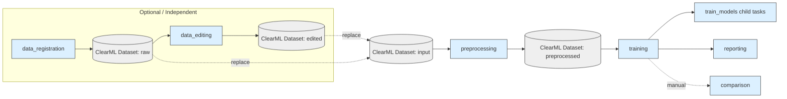
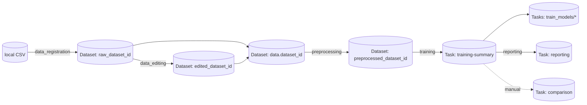

# README_dev.md

本ドキュメントは `automl_lib` を拡張・保守する開発者向けガイドです。  
「各フェーズ単独実行」「ClearML と連動したデータ/タスク管理」「後からモデルや処理を追加しやすい構成」を前提に、実装方針・入出力仕様・設定スキーマ・拡張ポイントをまとめます。

---

## 0. まず結論（開発者向けの運用最小セット）

- 実行は基本 `./.venv/bin/python -m automl_lib.cli.<command>` を使う（環境によって `python` が無い前提のため）
- データは原則 ClearML Dataset ID を入力として使う（`data.dataset_id`）
- 個別フェーズの I/O は `automl_lib/types/phase_io.py` の構造に合わせる
  - `DatasetInfo`（dataset/task/csv の受け渡し）
  - `TrainingInfo`（training summary の受け渡し）
  - `ComparisonInfo`（比較フェーズ結果）
  - `InferenceInfo`（推論フェーズ結果）
- PipelineController 実行中（`AUTO_ML_PIPELINE_ACTIVE=1`）は「step task を close しない」
  - step wrapper が戻り値/Artifactsを書き戻すため、早期 close で競合しやすい

---

## 1. ディレクトリ構成（開発者が触る場所）

```
automl_lib/
  cli/                # フェーズ単独実行 CLI（run_*.py）
  clearml/             # ClearML薄いラッパ（task/dataset/model/logging）
  config/              # pydantic スキーマ & loader（schemas.py/loaders.py）
  data/                # データ型推定など
  phases/              # 各フェーズ（processing/meta/visualization/clearml_integration）
  pipeline/            # PipelineController / in-process パイプライン
  preprocessing/       # 前処理パイプライン生成（ColumnTransformer）
  registry/            # models/metrics/preprocessors の登録（拡張ポイント）
  training/            # 学習（探索/評価/可視化/解釈/clearml管理）
  types/               # フェーズ間I/Oモデル（DatasetInfo/TrainingInfo/ComparisonInfo/InferenceInfo）
```

補足:

- 本リポジトリは `automl_lib/` と実行に必要な設定/テストのみを同梱します（旧実装は含みません）

---

## 2. 環境構築（開発者）

### 2.1 Python / venv

```bash
python3 -m venv .venv
source .venv/bin/activate
pip install -r requirements.txt
# 任意（Optuna/SHAP/LightGBM/TabPFN など）
pip install -r requirements-optional.txt
```

補足:

- `pydantic` は必須（設定バリデーションに使用）
- `clearml` は必須（ClearML連携/ローカルPipelineControllerに使用）
- `optuna` は `optimization.method=bayesian` 等で利用（無い場合は該当機能が落ちる）
- `shap` は解釈で optional（無い場合は SHAP を skip）

### 2.2 ClearML 設定

- `clearml.conf.example` を `clearml.conf` にコピーし、URL / 認証情報を設定してください。
  - `automl_lib/clearml/bootstrap.py` が（`clearml.conf` が存在すれば）自動で `CLEARML_CONFIG_FILE` を設定します。

### 2.3 ClearML サーバ

- ClearML サーバは別途用意してください（SaaS / 既存環境 / 自前ホスト）。
- サーバ側障害（Elasticsearch等）でログ送信が落ちる場合は、サーバログ/リソース状況を確認してください。

---

## 3. 実行コマンド（開発・検証用）

### 3.1 フェーズ単独実行（推奨）

```bash
# 1) data_registration（CSV -> ClearML Dataset）
./.venv/bin/python -m automl_lib.cli.run_data_registration \
  --config config_dataregit.yaml \
  --output-info outputs/datareg_info.json

# 2) data_editing（Dataset/CSV -> 編集 -> ClearML Dataset）
./.venv/bin/python -m automl_lib.cli.run_data_editing \
  --config config_editing.yaml \
  --input-info outputs/datareg_info.json \
  --output-info outputs/editing_info.json

# 3) preprocessing（既存Dataset -> 前処理 -> ClearML Dataset）
./.venv/bin/python -m automl_lib.cli.run_preprocessing \
  --config config_preprocessing.yaml \
  --output-info outputs/preprocessing_info.json

# 4) training（Dataset/CSV -> 学習/探索 -> summary + child tasks）
./.venv/bin/python -m automl_lib.cli.run_training \
  --config config_training.yaml \
  --input-info outputs/preprocessing_info.json \
  --output-info outputs/training_info.json

# 5) reporting（レポート: データ/前処理/推奨モデル/Top5意思決定表）
./.venv/bin/python -m automl_lib.cli.run_reporting \
  --config config.yaml \
  --preprocessing-info outputs/preprocessing_info.json \
  --training-info outputs/training_info.json \
  --output-info outputs/reporting_info.json

# （任意）複数runを横断比較したい場合（training_info を複数指定）
./.venv/bin/python -m automl_lib.cli.run_comparison \
  --config config_comparison.yaml \
  --training-info outputs/run1/training_info.json \
  --training-info outputs/run2/training_info.json \
  --output-info outputs/comparison_multi.json

# 6) inference（学習済みモデルで推論/探索）
./.venv/bin/python -m automl_lib.cli.run_inference \
  --config inference_config.yaml \
  --output-info outputs/inference_info.json
```

`--input-info` / `--training-info` は JSON/YAML の両対応です（`automl_lib/cli/common.py`）。

### 3.2 pipeline 実行（ClearML PipelineController または in-process）

```bash
# auto: config.clearml.enable_pipeline が true なら PipelineController を試し、失敗時 in-process にフォールバック
./.venv/bin/python -m automl_lib.cli.run_pipeline --config config.yaml --output-info outputs/pipeline_info.json

# in-process 強制
./.venv/bin/python -m automl_lib.cli.run_pipeline --config config.yaml --mode in_process --output-info outputs/pipeline_inproc.json

# ClearML PipelineController 強制（ClearML無効の場合は失敗）
./.venv/bin/python -m automl_lib.cli.run_pipeline --config config.yaml --mode clearml --output-info outputs/pipeline_clearml.json

# 任意: pipeline 前段で data_registration / data_editing を走らせたい場合
# - `--datareg-config` / `--editing-config` で専用YAMLを指定可能（省略時は `config_dataregit.yaml` / `config_editing.yaml` を自動検出）
# - `--preproc-config` / `--comparison-config` も指定可能（省略時は `config_preprocessing.yaml` / `config_comparison.yaml` を自動検出）
# - dataset_id が無い場合でも、前段が有効なら dataset_id を生成して preprocessing に渡す
./.venv/bin/python -m automl_lib.cli.run_pipeline \
  --config config_from_csv.yaml \
  --mode clearml \
  --datareg-config config_dataregit.yaml \
  --editing-config config_editing.yaml \
  --preproc-config config_preprocessing.yaml \
  --comparison-config config_comparison.yaml \
  --output-info outputs/pipeline_from_csv.json
```

### 3.3 テスト（最小単体テスト）

```bash
./.venv/bin/python -m unittest discover -s tests -v
```

---

## 4. フェーズI/O仕様（統一ルール）

### 4.1 目的

- フェーズ間の受け渡しを「最低限の共通構造」に固定して、後からフェーズを差し替え・追加しやすくします。
- CLI の `--output-info` をそのまま次フェーズの `--input-info` に渡せるようにします。

### 4.2 I/Oモデル（コード）

- `automl_lib/types/phase_io.py`
  - `DatasetInfo`: `dataset_id`, `task_id`, `csv_path`
  - `TrainingInfo`: `dataset_id`, `task_id`, `training_task_ids`, `metrics?`
  - `ComparisonInfo`: `task_id`, `artifacts[]`
  - `ReportingInfo`: `task_id`, `report_md`, `output_dir`

### 4.3 フェーズ別の入出力（開発者が守ること）

| フェーズ | 入力 | 出力 | 備考 |
|---|---|---|---|
| data_registration | `config_dataregit.yaml`（`data.csv_path`） | `DatasetInfo` | 重複は CSV hash で検出し再利用 |
| data_editing | `config_editing.yaml` + `DatasetInfo?(任意)` | `DatasetInfo` | 編集後CSV hash で重複検出し再利用 |
| preprocessing | `config_preprocessing.yaml`（または `config.yaml`） + `DatasetInfo?(任意)` | `DatasetInfo` | **入力は既存ClearML Dataset ID が基本** |
| training | `config_training.yaml`（または `config.yaml`） + `DatasetInfo?(任意)` | `TrainingInfo` | summary task + train_models 子タスク群 |
| reporting | `config.yaml` + `DatasetInfo/TrainingInfo` | `ReportingInfo` | `report.md`（データ概要/前処理要約/推奨モデル/Top5意思決定表）+ ClearML tables/text |
| comparison（manual） | `config_comparison.yaml`（または `config.yaml`） + `TrainingInfo` | `ComparisonInfo` | 複数run横断の比較用途。`comparison_metrics.csv` / `comparison_ranked.csv` / `best_result.json` / `best_by_model.*` 等 |
| inference | `inference_config.yaml` | `InferenceInfo` | 予測結果のCSV/画像パス・ClearML task id を返す |

統一ルール（重要）:

- `dataset_id` は **ClearML Dataset ID（32桁hex）** を入れる
- `task_id` は「そのフェーズの代表タスク（親）」を入れる（child task 群がある場合も親を入れる）
- 追加フィールドを増やす場合は `automl_lib/types/` に型を追加してから使う

---

## 5. 設定ファイル仕様（pydantic スキーマ基準）

### 5.1 スキーマ対応表

| ファイル | スキーマ | 用途 |
|---|---|---|
| `config.yaml` | `TrainingConfig` | training / pipeline の基本設定（preprocessing等も含む） |
| `config_dataregit.yaml` | `DataRegistrationConfig` | data_registration 単独 |
| `config_editing.yaml` | `DataEditingConfig` | data_editing 単独 |
| `config_preprocessing.yaml` | `PreprocessingConfig` | preprocessing 単独（`config.yaml` を渡してもOK） |
| `config_comparison.yaml` | `ComparisonConfig` | comparison 単独（`config.yaml` を渡してもOK） |
| `inference_config.yaml` | `InferenceConfig` | inference 単独 |

参照元:

- `automl_lib/config/schemas.py`
- `automl_lib/config/loaders.py`

### 5.2 共通: `data.*`（DataSettings）

| キー | 型 | 必須 | 使うフェーズ | 説明 |
|---|---:|:---:|---|---|
| `data.dataset_id` | `str?` | △ | preprocessing/training/pipeline | 入力 ClearML Dataset ID（推奨） |
| `data.csv_path` | `str?` | △ | data_registration/data_editing/training(フォールバック) | ローカルCSV（Datasetが無い場合の代替） |
| `data.target_column` | `str?` | △ | preprocessing/training | 目的変数列（未指定時は末尾列） |
| `data.feature_columns` | `list[str]?` | ✗ | preprocessing/training | 特徴量列（未指定時は target 以外全部） |
| `data.problem_type` | `regression|classification|null` | ✗ | training | タスク種別（未指定は自動推定） |
| `data.test_size` | `float` | ✗ | training | holdout の割合（`[0,1)`） |
| `data.random_seed` | `int` | ✗ | training | 乱数seed |

必須条件（TrainingConfigのバリデーション）:

- `data.dataset_id` または `data.csv_path` のどちらかは必須

### 5.3 preprocessing: `preprocessing.*`（PreprocessSettings）

| キー | 型 | 使うフェーズ | 説明 |
|---|---:|---|---|
| `preprocessing.plugins` | `list[str]` | preprocessing/training | import するプラグインモジュール（import時に `register_preprocessor()` を呼ぶ） |
| `preprocessing.numeric_imputation` | `list[str|null]` | preprocessing/training | 数値欠損補完（`mean|median|most_frequent|null`） |
| `preprocessing.categorical_imputation` | `list[str|null]` | preprocessing/training | カテゴリ欠損補完（`most_frequent|null`） |
| `preprocessing.scaling` | `list[str|null]` | preprocessing/training | スケーリング（例: `standard|minmax|robust|null`） |
| `preprocessing.categorical_encoding` | `list[str|null]` | preprocessing/training | エンコード（例: `onehot|ordinal|null`） |
| `preprocessing.polynomial_degree` | `false or int>=2` | preprocessing/training | 多項式特徴量 |
| `preprocessing.target_standardize` | `bool` | training | 目的変数標準化（回帰のみ） |
| `preprocessing.numeric_pipeline_steps` | `list[{name, params}]` | preprocessing/training | 数値列に追加ステップ（registry 名で指定） |
| `preprocessing.categorical_pipeline_steps` | `list[{name, params}]` | preprocessing/training | カテゴリ列に追加ステップ（registry 名で指定） |

### 5.4 training: `models.*`（ModelSpec）

| キー | 型 | 必須 | 説明 |
|---|---:|:---:|---|
| `models[].name` | `str` | ✓ | モデル名（registryで解決。大小/空白/ハイフン差異は吸収） |
| `models[].enable` | `bool` | ✗ | 有効/無効 |
| `models[].params` | `dict` | ✗ | ハイパラ（grid 等は list を入れる） |

必須条件（TrainingConfigのバリデーション）:

- `models` は非空
- `models[].enable=true` が1つ以上

### 5.5 training: `ensembles.*`

| キー | 型 | 説明 |
|---|---:|---|
| `ensembles.stacking.enable` | `bool` | stacking を作るか |
| `ensembles.stacking.estimators` | `list[str]` | stacking の base estimator 名 |
| `ensembles.stacking.final_estimator` | `str?` | final estimator 名 |
| `ensembles.voting.enable` | `bool` | voting を作るか |
| `ensembles.voting.estimators` | `list[str]` | voting 対象 |
| `ensembles.voting.voting` | `str?` | `hard|soft` 等 |

### 5.6 training: `cross_validation.*`

| キー | 型 | 説明 |
|---|---:|---|
| `cross_validation.n_folds` | `int?` | `>=2` / null なら自動 |
| `cross_validation.shuffle` | `bool` | 分割時に shuffle するか |
| `cross_validation.random_seed` | `int` | CV 用seed |

### 5.7 output: `output.*`

| キー | 型 | 使うフェーズ | 説明 |
|---|---:|---|---|
| `output.output_dir` | `str` | training | 出力ディレクトリ（モデル/結果/ログ） |
| `output.save_models` | `bool` | training | モデル保存 |
| `output.generate_plots` | `bool` | training | 可視化生成 |
| `output.results_csv` | `str` | training | 結果CSV名 |

preprocessing/comparison の出力ディレクトリ:

- preprocessing: `outputs/preprocessing`（デフォルト）  
  - 変更したい場合は `config_preprocessing.yaml` の `output.output_dir` を使う
- comparison: `outputs/comparison`（デフォルト）  
  - 変更したい場合は `config_comparison.yaml` の `output.output_dir` を使う

### 5.8 evaluation: `evaluation.*`

| キー | 型 | 説明 |
|---|---:|---|
| `evaluation.plugins` | `list[str]` | importする評価プラグイン（import時に `register_metric()` など） |
| `evaluation.regression_metrics` | `list[str]` | 回帰メトリクス名 |
| `evaluation.classification_metrics` | `list[str]` | 分類メトリクス名 |
| `evaluation.primary_metric` | `str?` | 最良モデル選択の指標（nullはデフォルト） |

### 5.9 optimization: `optimization.*`

| キー | 型 | 説明 |
|---|---:|---|
| `optimization.method` | `grid|random|bayesian` | 探索方式 |
| `optimization.n_iter` | `int>=1` | random/bayesian の試行回数 |

### 5.10 interpretation / visualizations

| キー | 型 | 説明 |
|---|---:|---|
| `interpretation.compute_feature_importance` | `bool` | 重要度計算 |
| `interpretation.compute_shap` | `bool` | SHAP計算（`shap` optional） |
| `visualizations.predicted_vs_actual` | `bool` | 予測vs実測 |
| `visualizations.residual_scatter` | `bool` | 残差散布図 |
| `visualizations.residual_hist` | `bool` | 残差ヒストグラム |
| `visualizations.feature_importance` | `bool` | 重要度プロット |
| `visualizations.shap_summary` | `bool` | SHAP summary |
| `visualizations.comparative_heatmap` | `bool` | 比較ヒートマップ |

### 5.11 ClearML: `clearml.*`（主なキー）

| キー | 型 | 説明 |
|---|---:|---|
| `clearml.enabled` | `bool` | ClearML 連携を使うか |
| `clearml.project_name` | `str?` | タスクを作るプロジェクト名 |
| `clearml.dataset_project` | `str?` | Dataset を登録するプロジェクト名 |
| `clearml.base_output_uri` | `str?` | Dataset/Artifacts の出力先（S3等） |
| `clearml.task_name` | `str?` | pipeline/training summary のタスク名 |
| `clearml.queue` | `str?` | デフォルト実行キュー |
| `clearml.services_queue` | `str?` | PipelineController 等サービス用途キュー |
| `clearml.tags` | `list[str]` | タスク/データセットに付けるタグ |
| `clearml.run_tasks_locally` | `bool` | agentが無い環境でもローカルで進める（fallback用） |
| `clearml.run_pipeline_locally` | `bool` | PipelineController をローカルで動かす |
| `clearml.raw_dataset_id` | `str?` | 入力 raw Dataset ID |
| `clearml.edited_dataset_id` | `str?` | 入力 edited Dataset ID |
| `clearml.preprocessed_dataset_id` | `str?` | 入力 preprocessed Dataset ID |
| `clearml.register_raw_dataset` | `bool` | data_registration を実行/登録するか |
| `clearml.enable_data_editing` | `bool` | pipeline で data_editing を有効にする（将来拡張用） |
| `clearml.enable_preprocessing` | `bool` | preprocessing を有効化 |
| `clearml.enable_training` | `bool` | training を有効化 |
| `clearml.enable_inference` | `bool` | inference を有効化（将来） |
| `clearml.enable_optimization` | `bool` | optimization を有効化（将来） |
| `clearml.enable_pipeline` | `bool` | pipeline 実行を有効化 |
| `clearml.comparison_mode` | `disabled|standalone|embedded` | 比較の集約方式（embedded=training-summary/reportingに集約。standalone比較タスクは手動実行） |
| `clearml.summary_plots` | `none|best|all` | training-summary へ転送する画像（best推奨） |
| `clearml.recommendation_mode` | `auto|training|comparison` | 推奨モデルの選び方（auto推奨） |
| `clearml.comparison_metrics` | `list[str]` | comparison で集計する指標 |
| `clearml.comparison_task_name` | `str?` | comparison タスク名 |
| `clearml.comparison_agent` | `str?` | legacy（未使用。フェーズ別キューは `clearml.agents.*` を利用） |
| `clearml.agents.*` | `str?` | フェーズ別キュー（未設定は `clearml.queue` を利用） |

### 5.12 comparison: `ranking.*`（比較/選定）

| キー | 型 | 説明 |
|---|---:|---|
| `ranking.metrics` | `list[str]` | 取得・集計するメトリクス（未指定なら `clearml.comparison_metrics` を利用） |
| `ranking.primary_metric` | `str?` | ランキングの基準メトリクス（`composite_score` も可） |
| `ranking.goal` | `min|max|null` | `primary_metric` の方向（nullなら自動判定） |
| `ranking.top_k` | `int?` | ClearMLの可視化/テーブル表示を上位N件に絞る（nullなら無制限） |
| `ranking.composite.enabled` | `bool` | `composite_score`（重み付き複合スコア）を計算する |
| `ranking.composite.metrics` | `list[str]` | `composite_score` に使うメトリクス（空なら `ranking.metrics` / weightsキーを利用） |
| `ranking.composite.weights` | `dict[str,float]` | `composite_score` の重み（未指定は1.0） |
| `ranking.composite.require_all_metrics` | `bool` | 欠損メトリクスがある行を `NaN` にする（true=厳密） |

比較フェーズの主なArtifacts（`output.output_dir` 配下）:

- `comparison_metrics.csv`: 収集したメトリクス（raw）
- `comparison_ranked.csv`: `ranking.primary_metric` でソートしたランキング（列に `composite_score` が入る場合あり）
- `comparison_ranked_topk.csv`: `ranking.top_k` 指定時の上位N件
- `best_result.json`: 最高行（best row）
- `best_by_model.csv` / `best_by_model.json`: モデルごとの最良行
- （複数run時）`best_by_run.*` / `best_by_run_model.csv` / `model_summary.csv` / `win_summary.csv` / `recommended_model.json`

---

## 6. Mermaid: 全体フロー / フェーズフロー / ClearML受け渡し

### 6.1 全体フロー（推奨: registration/editing は独立、pipeline は preprocessing→training→reporting）



### 6.2 data_registration

```mermaid
flowchart TD
  A[config_dataregit.yaml<br/>data.csv_path] --> B[hash_tag_for_path]
  B --> C{同一hashのDatasetが存在?}
  C -- Yes --> D[既存 dataset_id を返す]
  C -- No --> E[Dataset.create/add_files/upload/finalize]
  E --> F[DatasetInfo(dataset_id, task_id, csv_path)]
```

### 6.3 data_editing

```mermaid
flowchart TD
  A[config_editing.yaml<br/>data.dataset_id or data.csv_path] --> B[Load DataFrame]
  B --> C[Apply editing rules<br/>drop/rename/query/clip/fillna]
  C --> D[Write edited.csv]
  D --> E[hash_tag_for_path(edited.csv)]
  E --> F{同一hashのDatasetが存在?}
  F -- Yes --> G[既存 dataset_id を返す]
  F -- No --> H[Dataset.create(parent=source)/add_files/upload/finalize]
  H --> I[DatasetInfo(dataset_id, task_id, csv_path)]
  G --> I
```

### 6.4 preprocessing（入力は既存Datasetを前提）

```mermaid
flowchart TD
  A[DatasetInfo or config_preprocessing.yaml<br/>data.dataset_id] --> B[Dataset.get_local_copy]
  B --> C[feature type inference]
  C --> D[generate_preprocessors]
  D --> E[fit_transform -> preprocessed_features.csv]
  E --> F[Dataset.create(parent=input)/add_files/upload/finalize]
  F --> G[DatasetInfo(preprocessed_dataset_id, task_id, csv_path)]
```

### 6.5 training（summary + train_models 子タスク）

```mermaid
flowchart TD
  A[config.yaml + DatasetInfo(dataset_id)] --> B[training-summary Task]
  B --> C[download Dataset (optional)]
  C --> D[generate preprocessors]
  D --> E[model search/eval]
  E --> F[child task: train_<model>...]
  F --> G[metrics/models/artifacts]
  E --> H[summary aggregation]
  H --> I[TrainingInfo(task_id, training_task_ids, metrics)]
```

### 6.6 comparison（manual: training_info があればそれを優先）

```mermaid
flowchart TD
  A[TrainingInfo] --> B{metrics が入っている?}
  B -- Yes --> C[use metrics rows]
  B -- No --> D[Task.get_tasks / get_reported_single_values]
  C --> E[comparison_metrics.csv / comparison_ranked.csv / best_result.json 生成]
  D --> E
  E --> F[comparison Task (analysis)]
  F --> G[ComparisonInfo(task_id, artifacts)]
```

### 6.7 ClearML上での受け渡し（IDの流れ）



---

## 7. 拡張ポイント（どこを追加/修正すべきか）

### 7.1 新しい前処理ステップを追加したい

- 追加先（推奨）: `automl_lib/registry/preprocessors.py`
  - `register_preprocessor("my_step", builder, aliases=[...])`
- 設定での指定:
  - `preprocessing.numeric_pipeline_steps` / `preprocessing.categorical_pipeline_steps`
  - `preprocessing.plugins` にプラグインmodule名を追加（import時に登録する）
- 実装の中心:
  - パイプライン生成: `automl_lib/preprocessing/preprocessors.py`

### 7.2 新しい評価指標（metric）を追加したい

- 追加先:
  - `automl_lib/registry/metrics.py`（標準に含める場合）
  - または `automl_lib/plugins/*.py`（プロジェクト固有）
- 設定での指定:
  - `evaluation.plugins` にプラグイン module 名を追加
  - `evaluation.regression_metrics` / `evaluation.classification_metrics` に metric 名を追加
- scorer callable にも対応（例: `sklearn.metrics.make_scorer`）

### 7.3 新しいモデルを追加したい

- 追加先:
  - `automl_lib/registry/models.py`
    - `register_model("MyModel", regressor=..., classifier=..., aliases=[...])`
- 学習側の解決:
  - `automl_lib/training/model_factory.py` が registry から解決

### 7.4 新しいフェーズを追加したい（将来の推奨構成）

追加するディレクトリ:

```
automl_lib/phases/<new_phase>/
  processing.py
  clearml_integration.py
  meta.py              # メタ情報（構造化ログ/JSON）
  visualization.py     # 可視化（plots/artifacts）
```

追加するエントリ:

- CLI: `automl_lib/cli/run_<new_phase>.py`
- exports: `automl_lib/phases/__init__.py`
- pipeline: `automl_lib/pipeline/controller.py` に step 追加（必要なら）
- config:
  - `automl_lib/config/schemas.py` に専用Configを追加
  - `automl_lib/config/loaders.py` に loader を追加

### 7.5 ClearMLログ/Artifacts/Plotsを増やしたい

- `automl_lib/clearml/logging.py` の薄いラッパを使う（`report_table`, `report_plotly`, `upload_artifacts`）
- 各フェーズの `clearml_integration.py` / `processing.py` に集約して呼ぶ

---

## 8. 既知の残件 / 次の開発項目（ロードマップ）

完了:

- ✅ inference のI/O統一（`InferenceInfo` + `--output-info`）
- ✅ TrainingConfig のモデル名バリデーション（`models[].name` を早期検知）
- ✅ 旧 `automl_core` の削除（`automl_lib` に集約）
- ✅ pipeline に data_registration/data_editing を step として統合（任意）
- ✅ フェーズ別configの更なる分離（`config_training.yaml`、pipeline が `config_preprocessing.yaml` / `config_comparison.yaml` を自動利用）
- ✅ 出力ディレクトリの統一（preprocessing: `outputs/preprocessing`、comparison: `outputs/comparison`、data_editing: `outputs/data_editing`）
- ✅ 比較フェーズの拡張（ランキング/ベスト抽出/Artifacts追加）
- ✅ 比較フェーズの横断比較（複数run: `best_by_run.*` / `model_summary.csv` / mean-by-model plot）
- ✅ 最小単体テスト追加（config loaders / schemas / registry / phase I/O / comparison meta）
- ✅ テスト拡張（CLI / pipeline / phase processing のスモークテスト）
- ✅ `automl_lib/phases/__init__.py` を lazy import 化（起動高速化・不要依存の回避）
- ✅ comparison（ClearML無効時）の不要な Task name lookup を抑止
- ✅ comparison: ranking設定（`ranking.*`）/ `composite_score`（重み付き複合スコア）/ 選定Artifacts（`best_by_model.*`, `win_summary.csv`, `recommended_model.json`）を追加

次の優先度（高→低）:

1. **比較フェーズの拡張（続き）**（run間比較の可視化改善、複合スコアリング、モデル選定の自動化強化）
2. **E2Eスモーク（任意）**（ClearML有効で pipeline を最小データで1周させる/CI整備）

---

## 9. トラブルシュート（開発者）

### 9.1 ClearMLが `events.add_batch` で落ちる

- サーバ側（Elasticsearch 等）の障害/メモリ不足の可能性があります
- ClearML サーバのログとリソース状況（メモリ/ディスク）を確認してください

### 9.2 PipelineController ローカル実行で task close 周りが不安定

- `AUTO_ML_PIPELINE_ACTIVE=1` の間は step task を close しない（`flush(wait_for_uploads=True)` のみ）

### 9.3 警告ログがうるさい

- 既定で抑制しています。戻す場合:
  - `AUTO_ML_SUPPRESS_WARNINGS=0`
