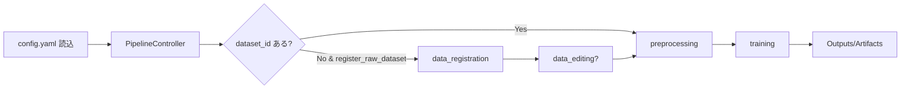
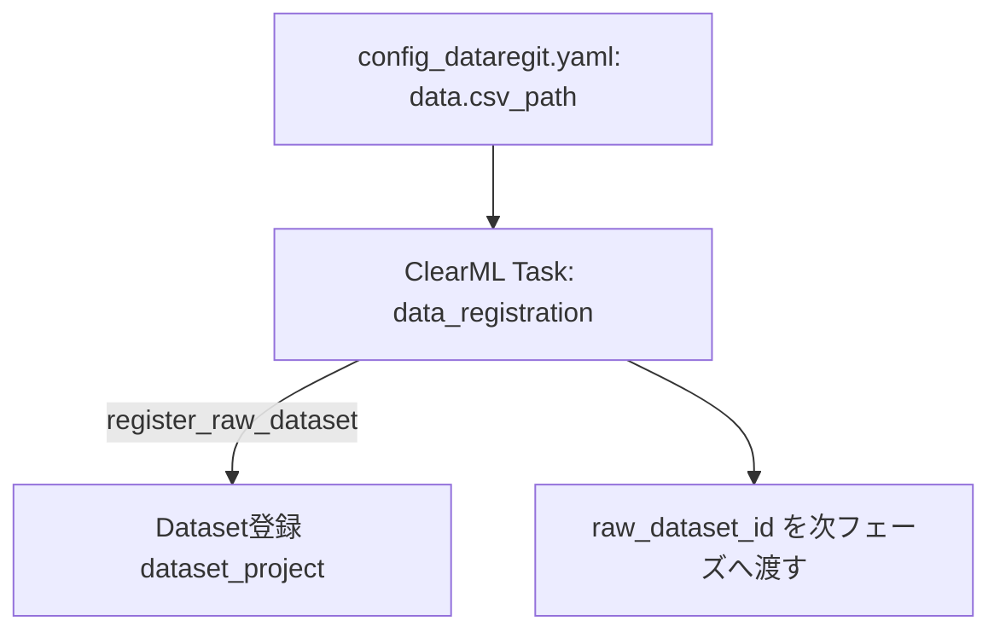
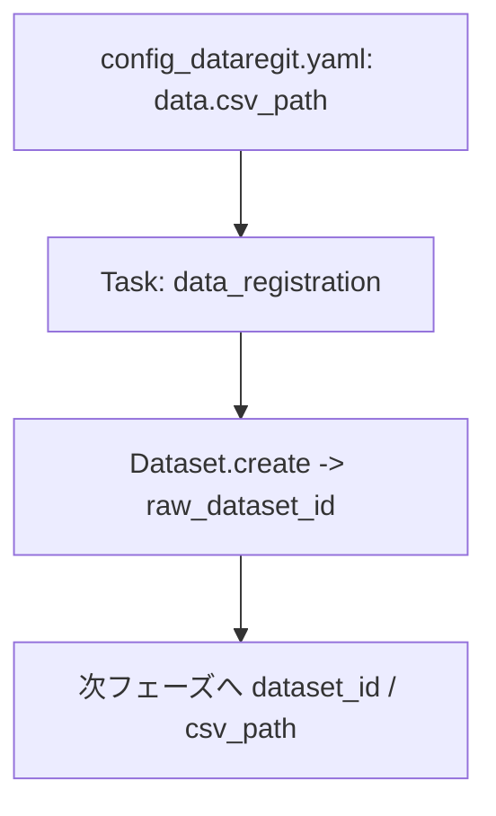
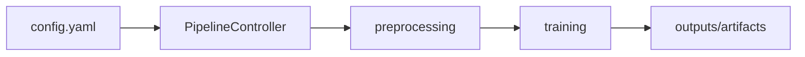

# README_user.md

本ドキュメントは、リファクタ後のAutoMLモジュールを利用する際の環境構築手順、フェーズ別の実行コマンド、設定パラメータの意味、ClearMLとの連携方法をまとめた利用者向けガイドです。  
本リポジトリは新CLI（`automl_lib/cli`）を前提とします（旧 `train.py` / `inference.py` は同梱しません）。

---

## 0. ClearMLで迷わない見方（最短導線）

1. **Pipelineタスク（Controller）**を開き、`data.dataset_id` を入力して実行
2. 生成された **Training Summary（親タスク / training-summary）** を開く
3. 見る場所は固定（ここ以外は基本見ません）:
   - `Configuration`:
     - `Training`（学習の入力設定だけが出ます）
       - Pipeline（PipelineController）経由で実行した場合、ClearMLの内部メタとして `kwargs` / `kwargs_artifacts` / `properties` が表示されますが、基本は編集不要です（編集するとpipeline/stepの挙動を壊す可能性があります）。
     - `USER PROPERTIES`（検索/一覧化に使う要約: `recommended_model_id` など）
     - `Configuration Objects`（参照用: `OmegaConf` / `ChildTasks` / `Dataset` / `Preprocessing`）
   - `Plots`（上から順に見る）:
     - `01_Recommended Model`（推奨モデルと `model_id`）
     - `02_Leaderboard` / `03_Leaderboard Table`（モデル比較）
     - `04_Tradeoff`（任意: 精度と学習時間などのトレードオフ）
     - `05_Scatter Plot of Recommended Model`（推奨モデルの真値-予測）
     - `06_Feature Importance from Recommended Model`
     - `07_Interpolation space: ...`（推奨モデルのPCA）
     - `08_SHAP values`
   - `Artifacts`:
     - `leaderboard.csv` / `results_summary.csv`（比較表）
     - `recommended_model.csv` / `recommendation_rationale.{md,json}`（推奨理由）
     - `error_models.json`（一部モデルが失敗した場合の理由）
4. 推論は training-summary の `recommended_model_id` を `inference_config.yaml` の `model_id` に入れて `run_inference` を実行

補足:
- summary は「推奨モデルの最小セット + 比較」に絞ります（全モデル分の重い可視化は出しません）。
- `03_Leaderboard Table` のリンク列から、各モデルの子タスクへ遷移できます（詳細分析は子タスク側）。

## 1. 環境構築

### 前提
- Python 3.10+ 推奨
- ClearML サーバが起動済み（ローカル: http://localhost:8080 など）
- Docker/Colima を利用する場合はデーモンが起動していること

### セットアップ手順
#### Windows（cmd.exe）
```bat
REM リポジトリ直下で実行（PowerShell の場合は先頭に .\ を付けます）
install.bat

REM 任意: Optuna/SHAP/LightGBM/TabPFN なども入れる
install.bat --optional

REM venv 有効化（コマンド例はこれを前提）
call .venv\Scripts\activate.bat
```
- PowerShell の場合: `.\install.bat` / `.\.venv\Scripts\Activate.ps1`
- ClearML を使う場合: `clearml.conf` を編集（未作成なら `install.bat` が `clearml.conf.example` から作成します）

### ClearML 設定の確認
- `clearml.conf.example` を `clearml.conf` にコピーし、`web_server` / `api_server` / `files_server` と認証情報を設定
- `config.yaml` の `clearml` セクションでプロジェクト名/キュー名を指定（例は後述）

---

## 2. 実行コマンド一覧

### 新CLI（automl_lib / フェーズ単独実行、ClearMLタスク再利用防止・設定バリデーション付き）
- パイプライン（ClearML PipelineController のみ。使えない場合はエラー）  
  `python -m automl_lib.cli.run_pipeline --config config.yaml --output-info outputs\pipeline_info.json`
  - 任意: pipeline 前段で `data_registration` / `data_editing` の設定YAMLを指定する場合:
    - `--datareg-config config_dataregit.yaml`
    - `--editing-config config_editing.yaml`
  - 任意: pipeline の preprocessing 設定YAMLを指定する場合:
    - `--preproc-config config_preprocessing.yaml`
  - 任意: pipeline の inference 設定YAMLを指定する場合（`clearml.enable_inference: true` のとき）:
    - `--inference-config inference_config.yaml`
- データ登録のみ（重複チェック: CSVハッシュ）  
  `python -m automl_lib.cli.run_data_registration --config config_dataregit.yaml`
- データ編集のみ（重複チェック: 編集後CSVハッシュ）  
  `python -m automl_lib.cli.run_data_editing --config config_editing.yaml`
- 前処理のみ  
  `python -m automl_lib.cli.run_preprocessing --config config_preprocessing.yaml`
- 学習フェーズのみ  
  `python -m automl_lib.cli.run_training --config config_training.yaml`
- 推論フェーズのみ  
  `python -m automl_lib.cli.run_inference --config inference_config.yaml`

※ 全CLIで実行前に pydantic による設定バリデーション、`CLEARML_TASK_ID` クリアを行い、毎回新規タスクを作成します（必要に応じて `--output-info` で結果JSONを保存可能）。  
※ `config.yaml` を `run_preprocessing` に渡しても動作します（必要キーだけ抽出してバリデーションします）。

---

## 3. 設定パラメータ（主要項目）

### 学習用 config.yaml（抜粋）
| セクション | キー | 説明 |
|------------|------|------|
| data | dataset_id | 入力ClearML Dataset ID（推奨。無い場合は前段で生成） |
| data | csv_path | 入力CSVパス（data_registration/editing用、またはフォールバック） |
| data | target_column | 目的変数列名 |
| data | feature_columns | 入力特徴量の列名リスト（省略時は目的変数以外すべて） |
| data | test_size | ホールドアウト割合 (0〜1未満) |
| clearml | enabled | ClearML連携を有効にするか |
| clearml | project_name | 学習タスクのプロジェクト名 |
| clearml | dataset_project | Dataset登録先プロジェクト名 |
| clearml | register_raw_dataset | pipeline 前段で CSV -> Dataset 登録を行う（`config_dataregit.yaml` を利用） |
| clearml | enable_data_editing | pipeline 前段で Dataset/CSV -> 編集 -> Dataset 登録を行う（`config_editing.yaml` を利用） |
| clearml | queue | 実行キュー名（未指定ならローカル実行） |
| clearml | services_queue | パイプラインコントローラ用キュー（任意） |
| clearml | enable_pipeline | PipelineControllerを使うか |
| clearml | run_pipeline_locally | Trueならローカルでパイプライン実行 |
| clearml | summary_plots | training-summary の Plots に「推奨モデル(best)のみ」の結果（例: Pred vs True / PCA 等）を表示するか（`none|best`。`all` は互換用で best 扱い） |
| clearml | recommendation_mode | 推奨モデルの選び方（`auto` / `training`） |
| preprocessing | numeric_imputation / categorical_imputation / scaling / categorical_encoding | 前処理戦略 |
| models | name / params | 使用モデル名とハイパラ（複数可） |
| cross_validation | n_folds / shuffle / random_seed | CV設定 |
| output | output_dir / save_models | 出力先とモデル保存可否 |

### 利用できる学習モデル一覧（`models[].name`）
`models[].name` は大小無視で、`-` / `_` / 空白も無視して解決されます（例: `RandomForest`, `random_forest`, `random-forest` は同じ扱い）。  
また、追加インストールしたライブラリに応じて利用できるモデルが増えます（推奨: `install.bat --optional`。手動なら `python -m pip install -r requirements-optional.txt`）。  
（分類/回帰の自動判定は `data.problem_type` か、未指定の場合は目的変数から推定します。）

この一覧は `automl_lib/registry/models.py` のデフォルト登録（＋ optional パッケージ検出）に対応しており、`config.yaml: models[].name` に指定できる「組み込みモデル」をそのまま列挙しています。  
表形式データのAutoMLで実際に候補になりやすい主要ファミリー（線形/正則化、近傍、カーネル、木アンサンブル、確率モデル、ニューラル）を揃えつつ、表形式で強いことが多い GBDT 系（`LightGBM` / `XGBoost` / `CatBoost`）や、近年の深層学習系（`TabNet`）・事前学習系（`TabPFN`）も含みます。  
※「ライブラリ更新目安」は、本リポジトリの `requirements.txt` / `requirements-optional.txt` に記載している最小バージョンが出た頃（目安）です（実際の環境はインストール版に依存します）。

| モデル名（例） | 回帰/分類 | ライブラリ更新目安（最小要求） | 特徴 | メリット | デメリット | 使いどころ |
|---|---|---|---|---|---|---|
| `LinearRegression` | 回帰 | `scikit-learn>=1.3`（2023頃〜） | 線形（正則化なし） | 高速・基準値になりやすい | 非線形に弱い | まずベースライン |
| `Ridge` | 回帰/分類 | `scikit-learn>=1.3`（2023頃〜） | 線形 + L2正則化 | 安定・多重共線性に強い | 強い非線形は表現しにくい | 高次元のベースライン |
| `Lasso` | 回帰 | `scikit-learn>=1.3`（2023頃〜） | 線形 + L1正則化 | 特徴量選択（疎）になりやすい | 相関が強い特徴量が多いと不安定 | 特徴量を絞りたい |
| `ElasticNet` | 回帰 | `scikit-learn>=1.3`（2023頃〜） | 線形 + L1/L2 | Lassoより安定しやすい | 正則化係数の調整が必要 | 相関あり + 特徴選択 |
| `KNeighbors` (`KNN`) | 回帰/分類 | `scikit-learn>=1.3`（2023頃〜） | 近傍ベース | 学習が軽い・非線形に対応 | 推論が遅い/スケーリングに敏感 | 小規模・局所パターン |
| `SVR` | 回帰 | `scikit-learn>=1.3`（2023頃〜） | カーネルSVR | 小〜中規模で強いことがある | 大規模で遅い/パラメータ感度 | 非線形・データ少なめ |
| `RandomForest` | 回帰/分類 | `scikit-learn>=1.3`（2023頃〜） | 決定木のバギング | 頑健・扱いやすい | GBDT系より精度が伸びにくいことがある | まず堅い選択肢 |
| `ExtraTrees` | 回帰/分類 | `scikit-learn>=1.3`（2023頃〜） | ランダム性を強めた木 | 高速・過学習しにくいことがある | 精度のブレ/モデルが大きくなりがち | 速さ重視の木モデル |
| `GradientBoosting` | 回帰/分類 | `scikit-learn>=1.3`（2023頃〜） | sklearnのGBDT | 標準構成でRFより高精度になりやすい | 大規模だと遅い/機能は控えめ | 依存追加なしでGBDT |
| `GaussianProcess` | 回帰/分類 | `scikit-learn>=1.3`（2023頃〜） | ガウス過程 | 不確かさ推定が可能 | 計算が重い（データ数に弱い） | 超小規模・検証用途 |
| `MLP` | 回帰/分類 | `scikit-learn>=1.3`（2023頃〜） | sklearnのNN | 非線形表現が可能 | 収束やスケール調整が難しい | 木系が合わないとき |
| `LogisticRegression` | 分類のみ | `scikit-learn>=1.3`（2023頃〜） | 線形分類 | 高速・解釈しやすい | 非線形境界に弱い | 分類のベースライン |
| `SVC` (`SVM`) | 分類のみ | `scikit-learn>=1.3`（2023頃〜） | カーネルSVM | 小〜中規模で強いことがある | 大規模で遅い/スケーリングに敏感 | 高次元・小規模分類 |
| `LightGBM`（要: `lightgbm`） | 回帰/分類 | `lightgbm>=4.0`（2023頃〜） | 高速GBDT | 定番・高精度になりやすい | パラメータが多い/過学習注意 | まず試す第一候補 |
| `XGBoost`（要: `xgboost`） | 回帰/分類 | `xgboost>=2.0`（2023頃〜） | 堅牢GBDT | 実績が多く安定しやすい | 設定が多い/学習が重め | LightGBMと比較 |
| `CatBoost`（要: `catboost`） | 回帰/分類 | `catboost>=1.2`（2023頃〜） | カテゴリに強いGBDT | カテゴリ列が多いと強いことがある | 学習が重め/依存追加 | カテゴリが多いデータ |
| `TabNet`（要: `torch`, `pytorch-tabnet`） | 回帰/分類 | `torch>=2.0`（2023頃〜）+ `pytorch-tabnet>=4.1` | Deep tabular | 複雑な相互作用を捉えることがある | 学習が重い（GPU推奨） | 大きめデータで試す |
| `TabPFN`（要: `tabpfn` + 学習済み重み） | 回帰/分類 | `tabpfn>=0.1`（2024頃〜） | 事前学習モデル | 小規模データで強いことがある | 重みファイルがないとスキップされる | データ少なめで試す |

補足:

- data_editing の出力は `outputs/data_editing/<run_id>`（デフォルト。`editing.output_dir`/`editing.output_filename` で変更可。`editing.output_path` 指定時はそちら優先）
- preprocessing の出力は `outputs/preprocessing/<run_id>`（デフォルト）
- training の出力は `outputs/train/<run_id>`（デフォルト）

### 推論用 inference_config.yaml（抜粋）
optimize の設定例: `inference_config_optimize_example.yaml`

| セクション | キー | 説明 |
|------------|------|------|
| model_id | - | 推論に使う ClearML Model ID（training-summary の `recommended_model_id`） |
| model_name | - | 任意（ClearML上の表示用ラベル） |
| clearml | enabled, project_name, task_name, queue | 推論タスク作成用のClearML設定 |
| input | mode | `single` / `batch` / `optimize` |
| input | single / single_json | single の入力（inline dict またはJSON） |
| input | csv_path / dataset_id | batch の入力（CSVパス or ClearML Dataset ID） |
| input | variables / params_path | optimize の探索変数定義（inline list またはJSONパス） |
| search | method | grid/random/tpe/cmaes（optimize のみ） |
| search | n_trials | 最適化試行数（optimize のみ） |
| search | goal | min/max（optimize のみ） |
| output_dir | - | 推論結果の出力ディレクトリ |

### 設定パラメータ詳細（学習・推論共通でよく触る項目）
| カテゴリ | キー | 用途/メモ |
|----------|------|-----------|
| data | dataset_id / csv_path | pipeline は dataset_id 必須。未指定時はcsv_pathを読み込む（主に data_registration/editing 用） |
| preprocessing | numeric_imputation, scaling, categorical_encoding | 候補をリストで並べると直積で検証される |
| models | name, enable, params | 1モデルにつき1エントリ。paramsはgrid/random/bayesianの探索空間 |
| optimization | method, n_iter | `grid`=全探索、`random`/`bayesian`=Optuna系探索 |
| evaluation | primary_metric | 最良モデルの決定指標。未指定時は regression=r2, classification=accuracy |
| clearml | enable_pipeline | PipelineControllerの有効化 |
| clearml.agents | preprocessing/training/inference/pipeline | 各フェーズの実行キュー。未設定ならqueueを使用 |
| inference.input | mode | `single`=単発、`batch`=一括、`optimize`=条件探索/最適化 |
| inference.search | method/n_trials/goal | Optunaのサンプラーと目的方向 |

### フェーズ別 入出力/主要設定
| フェーズ | 主入力 | 主出力 | 主要設定キー |
|----------|--------|--------|--------------|
| データ登録 | data.csv_path / data.dataset_id | raw_dataset_id (ClearML) | clearml.register_raw_dataset |
| データ編集 | raw_dataset_id / CSV | edited_dataset_id / `outputs/data_editing/<run_id>/edited.csv` | editing.* |
| 前処理 | data.dataset_id (既存Dataset) | preprocessed_dataset_id / `outputs/preprocessing/<run_id>/dataset/data_processed.csv` | preprocessing.* |
| 学習 | preprocessed_dataset_id or CSV | models/*.joblib, metrics/results_summary.csv, training tasks | models, optimization, evaluation, output.* |
| 推論 | model_id（ClearML Model） | 予測結果/探索結果（Artifacts/Plots） | model_id, input, search, output_dir |
| パイプライン | config.yaml | PipelineController task（ClearML） | clearml.enable_pipeline, clearml.run_pipeline_locally, clearml.services_queue |

---

## 4. フローチャート（全体とフェーズ別）

### 全体パイプライン（概要）


### データ登録フェーズ


### データ編集フェーズ
```mermaid
flowchart TD
    A[config_editing.yaml: raw_dataset_id or CSV] --> B[ClearML Task: data_editing]
    B --> C[編集結果CSV書き出し]
    B --> D[Dataset登録 edited (任意)]
    B --> E[編集差分ログを Debug Samples/Artifacts]
    E --> F[edited_dataset_id を次へ]
```

### 前処理フェーズ
```mermaid
flowchart TD
    A[data.dataset_id (既存Dataset)] --> B[ClearML Task: preprocessing]
    B --> C[特徴量型判定 -> 前処理パイプライン生成]
    C --> D[変換後データセット(任意でDataset登録)]
    D --> E[preprocessed_dataset_id を学習へ渡す]
```

### 学習フェーズ（summary + per-model）
```mermaid
flowchart TD
    A[preprocessed_dataset_id or CSV] --> B[ClearML Task: training-summary]
    B --> C[各モデル・前処理組合せの評価]
    C --> D[子タスク train_<model> (train_models プロジェクト)]
    D --> E[メトリクス/プロット/モデル保存 (OutputModel/Artifact)]
    C --> F[summary集計 (Plots/Artifacts/Debug Samples)]
```

### 推論フェーズ（single/batch は単独、optimize は summary + Prediction_runs）
```mermaid
flowchart TD
    A[inference_config] --> C{mode}
    C -- single --> D[Task: infer single]
    C -- batch --> E[Task: infer batch]
    C -- optimize --> B[Task: inference-summary]
    B --> P[Prediction_runs/*: 子タスク predict rank:* (all trials)]
    D --> G[Artifacts: input.json/output.json]
    E --> H[Artifacts: predictions.csv]
    B --> I[Artifacts: trials.csv/best_solution.json]
    P --> G
```

### ClearML 上でのデータ/モデル受け渡し（IDの流れ）
```mermaid
flowchart LR
    raw_csv[data.csv_path] --> reg[Task: data_registration (任意)]
    reg --> ds_raw[Dataset: raw_dataset_id]
    ds_raw --> edit[Task: data_editing (任意)]
    edit --> ds_edit[Dataset: edited_dataset_id]
    ds_raw --> ds_in[Dataset: data.dataset_id (既存)]
    ds_edit --> ds_in
    ds_in --> pre[Task: preprocessing]
    pre --> ds_pre[Dataset: preprocessed_dataset_id]
    ds_pre --> train_task[Task: training-summary]
    train_task --> model_tasks[Task: train_<model>...]
```

---

## 5. ClearML連携のポイント
- 各フェーズ開始時に `CLEARML_TASK_ID` をクリアし、毎回新規タスクを作成（タスク再利用による停止を防止）。
- 親子タスク:
  - データ登録/編集/前処理/学習は順次親子リンクを設定（`AUTO_ML_PARENT_TASK_ID` or init_task）。
  - 学習では summary 親タスク + 各モデル子タスク（`<parent_project>/train_models`）。
  - 推論では single/batch は単独タスク、optimize は summary 親タスク + Prediction_runs(全trial) 子タスク。
- Dataset登録:
  - raw/edited/preprocessed で必要に応じて Dataset を作成し、次フェーズへ dataset_id を渡す。
- モデル登録:
  - 学習フェーズで OutputModel として登録、推論では InputModel (model_id) を指定するとレジストリからロード。
- training-summary の推奨モデル:
  - `recommended_model.csv` と `recommendation_rationale.{md,json}` を出力し、ClearML の `Artifacts` から参照できます。
  - `Configuration > USER PROPERTIES` に `recommended_model_id` を保存します（推論用にコピペ）。
- 前処理の確認（長い1行のダンプを避ける）:
  - 前処理Datasetに `preprocessing/summary.md`（カテゴリ別）を含め、training-summary 側でも `Configuration Objects > Preprocessing` と `Artifacts` に保存します。
- キュー/サービスキュー:
  - `queue` で通常タスクの実行先、`services_queue` で PipelineController をサービスキューに乗せる設定が可能。
- ログノイズ抑制:
  - 証明書無効警告などはデフォルトで抑制しています。戻したい場合は `AUTO_ML_SUPPRESS_WARNINGS=0` を設定してください。

---

## 6. よく使う設定例

### ClearML付きパイプライン例（config.yaml 抜粋）
```yaml
clearml:
  enabled: true
  project_name: "AutoML-with-ClearML"
  dataset_project: "AutoML-datasets"
  queue: "default"
  services_queue: "services"
  enable_pipeline: true
  run_pipeline_locally: false
  # training-summary の Plots には「推奨モデル(best)のみ」の結果プロットだけを表示できます（none|best）
  summary_plots: "best"
  run_tasks_locally: false
  agents:
    data_registration: "default"
    data_editing: "default"
    preprocessing: "default"
    training: "default"
    pipeline: "services"
```

### 推論でClearMLモデルを使う例（inference_config.yaml 抜粋）
```yaml
models:
  - name: Ridge
    enable: true
    model_id: "clearml-model-id-123"  # InputModelからロード
  - name: RandomForest
    enable: true
    # model_id未指定の場合は model_dir の joblib を利用
```

---

## 7. トラブルシュート
- タスクが再利用される/止まる: 各CLIで `CLEARML_TASK_ID` をクリア済みか確認。キュー/Agentが存在するかも確認（remote pipeline は起動時に preflight でチェックします。必要なら `AUTO_ML_SKIP_CLEARML_QUEUE_CHECK=1`）。
- PipelineControllerが出ない: `clearml.enable_pipeline: true` か、services_queue/queueが正しく設定されているか確認。ログの `[PipelineController]` 出力を参照。
- Datasetが学習プロジェクトに紐づく: `clearml.dataset_project` を明示設定する。
- ClearMLサーバ未接続: clearml.conf のURLとサーバ起動状態を確認（docker ps / curl http://localhost:8080 など）。

---

## 8. 開発エンジニア向け：追加実装/改修の指針

### フェーズ共通の入出力仕様
- 入力: `config.yaml`（学習） / `inference_config.yaml`（推論）。ClearMLが有効な場合は dataset_id / model_id を引き回す。
- 出力: フェーズごとのタスク（ClearML Task）、Artifacts（CSV/モデル）、Plots（主要グラフ）、Hyperparameters（connect_params でカテゴリ別）。
- タスク再利用防止: フェーズ開始前に `CLEARML_TASK_ID` をクリア。親子リンクは `init_task`/`create_child_task` で明示。

### フェーズ別の入出力と改修ポイント

| フェーズ | 入力 | 出力 | 主な処理 | 追加/修正すべき箇所 |
|----------|------|------|----------|----------------------|
| データ登録 | csv_path (config) | raw_dataset_id, Task | CSVをDataset登録 | 前処理前に新しいフォーマット/検証を入れたい場合はここで実装 |
| データ編集 | raw_dataset_id or CSV | edited_dataset_id, Task | 列削除/置換/フィルタ等 | 新しい編集ルールを追加する場合は editing 設定と処理を拡張 |
| 前処理 | edited_dataset_id or raw | preprocessed_dataset_id, Task | 特徴量型判定→前処理Pipeline生成→transform | 前処理ステップは registry 方式で追加/差し替えやすくする |
| 学習 | preprocessed_dataset_id or CSV | training-summary Task + per-model Tasks + OutputModel/Artifacts | CV評価・メトリクス記録・モデル保存 | モデル/ハイパラは registry に追加。Plots/Artifactsは指定の形式に統一 |
| 推論 | model_id（ClearML Model） | single/batch: `infer <mode>`（単独） / optimize: inference-summary + Prediction_runs(全trial) | 単発/一括/最適化 → 予測/最適解 | 新しい最適化アルゴリズムや指標を追加するときは inference の search 部分に拡張 |
| パイプライン | config.yaml | Pipeline Controller Task | 各フェーズをキュー実行 | 新フェーズ追加時は PipelineController にステップを追加 |

### Pipeline／設定変数（表）

| カテゴリ | 変数 | 用途 |
|----------|------|------|
| clearml | enabled | ClearML連携ON/OFF |
| clearml | project_name | タスクが属するプロジェクト |
| clearml | dataset_project | Dataset登録先プロジェクト |
| clearml | queue | 通常タスクのキュー |
| clearml | services_queue | Pipeline Controller用キュー |
| clearml | enable_pipeline | PipelineControllerを使うか |
| clearml | run_pipeline_locally | ローカルでパイプラインを動かすか |
| clearml | summary_plots | training-summary の Plots に「推奨モデル(best)のみ」の結果（例: Pred vs True / PCA 等）を表示するか（`none|best`。`all` は互換用で best 扱い） |
| clearml.agents | data_registration/data_editing/preprocessing/training/inference/pipeline | 各ステップの実行キュー（未設定なら clearml.queue） |
| preprocessing | numeric_imputation / categorical_imputation / scaling / encoding | 前処理手法の選択 |
| models | name / params | 使用するモデルとパラメータ |
| cross_validation | n_folds / shuffle | CV設定 |
| inference.input | mode (single/batch/optimize) | 推論モード |
| inference.search | method / n_trials / goal | 範囲探索・最適化のアルゴリズムと目的 |

---

## 9. 各フェーズの処理フロー（Mermaid）

### データ登録


### データ編集
```mermaid
flowchart TD
    A[config_editing.yaml: raw_dataset_id or CSV] --> B[Task: data_editing]
    B --> C[編集処理 (drop/rename/fill/query...)]
    C --> D[edited CSV / dataset_id]
    D --> E[差分ログを Debug Samples/Artifacts]
```

### 前処理
```mermaid
flowchart TD
    A[data.dataset_id (既存Dataset)] --> B[Task: preprocessing]
    B --> C[特徴量型判定 -> 前処理ステップ適用]
    C --> D[変換データ / dataset_id]
    D --> E[学習フェーズへ渡す]
```

### 学習（summary + per-model）
```mermaid
flowchart TD
    A[preprocessed_dataset_id or CSV] --> B[Task: training-summary]
    B --> C[モデル×前処理の評価 (CV)]
    C --> D[子タスク train_<model> (train_models プロジェクト)]
    D --> E[メトリクス/プロット/モデル保存(OutputModel/Artifact)]
    C --> F[summary 集計 (Plots/Artifacts/Debug Samples)]
```

### 推論（single/batch は単独、optimize は summary + Prediction_runs）
```mermaid
flowchart TD
    A[inference_config] --> C{mode}
    C -- single --> D[Task: infer single]
    C -- batch --> E[Task: infer batch]
    C -- optimize --> B[Task: inference-summary]
    B --> P[Prediction_runs/*: 子タスク predict rank:* (all trials)]
    D --> G[Artifacts: input/output]
    E --> H[Artifacts: predictions.csv]
    B --> I[Artifacts: trials.csv/best_solution.json]
    P --> G
```

### パイプライン（Controller）


---

## 10. 追加開発の指針
- 前処理を増やす: `preprocessing.numeric_pipeline_steps` / `preprocessing.categorical_pipeline_steps` に registry 登録済みTransformerを追加して差し込み可能（独自追加は `preprocessing.plugins` で module import → `register_preprocessor()`）。
- モデルを増やす: `automl_lib/registry/models.py` に `register_model()` を追加し、`config.yaml: models[].name` に列挙すれば評価対象に入る。
- 評価指標を増やす: `automl_lib/registry/metrics.py` に `register_metric()` を追加し、`evaluation.plugins` 経由で読み込んで `evaluation.*_metrics` に列挙する。
- 推論アルゴリズムを拡張: inference.search に新しいmethodを追加し、Optunaサンプラーや独自探索を実装。
- パイプラインに新フェーズを追加: PipelineControllerにステップ追加、前後のデータ/ID受け渡しを規定し、mermaid図を更新。

### 前処理の差し込み例（PCA）
`automl_lib/registry/preprocessors.py` には `pca`, `quantile`, `standard`, `minmax`, `robust`, `onehot`, `ordinal` などが既定登録されています。

```yaml
preprocessing:
  # 独自Transformerを使う場合は plugins で import（import先で register_preprocessor() を呼ぶ）
  # plugins: ["your_project.automl_plugins.preprocessors"]
  numeric_pipeline_steps:
    - name: pca
      params:
        n_components: 5
```

### 評価指標の差し込み例（custom metric）
`automl_lib/registry/metrics.py` には `r2`, `mae`, `mse`, `rmse`, `accuracy`, `f1_macro`, `roc_auc_ovr` などが既定登録されています。

```yaml
evaluation:
  # plugins で import（import先で register_metric() を呼ぶ）
  # plugins: ["your_project.automl_plugins.metrics"]
  regression_metrics: ["mae", "rmse", "r2", "mape", "smape"]
  classification_metrics: ["accuracy", "f1_macro", "roc_auc_ovr"]
```

### 開発エンジニア向けチェックリスト（改修時に見る場所）
| 目的 | 主なコード/設定 | 備考 |
|------|-----------------|------|
| 前処理を追加/変更 | automl_lib/preprocessing/preprocessors.py, automl_lib/registry/preprocessors.py, config.yaml: preprocessing | `*_pipeline_steps` + registry で差し込み可能 |
| モデルを追加/既存調整 | automl_lib/registry/models.py, config.yaml: models | 新モデル/エイリアス登録はここ（探索空間は config.yaml: models[].params） |
| HPO戦略を追加 | automl_lib/training/search.py, config.yaml: optimization.method | Optunaサンプラを増やす場合は依存パッケージも追記 |
| 指標を追加/変更 | automl_lib/registry/metrics.py, config.yaml: evaluation | `evaluation.plugins` で外部moduleから登録可（rmseはmse由来のderived指標） |
| ClearML連携調整 | automl_lib/integrations/clearml/*, automl_lib/training/clearml_integration.py, config.yaml: clearml.* | Task/Queue/Agent/Dataset の指定をここで共通化 |
| 推論挙動を拡張 | automl_lib/inference/*, inference_config.yaml | 入力モードや検索アルゴリズムを追加する場合はここを更新 |
| 設定バリデーション | automl_lib/config/schemas.py, automl_lib/config/loaders.py | 不明キーはエラー（typo検知） |
| ドキュメント更新 | README_user.md, README.md | コマンド例・Mermaid・設定表を同期する |

### 実行前の動作確認（推奨）
- 小さなデータで `python -m automl_lib.cli.run_training --config config.yaml` を実行し、`outputs/train` に結果が出ることを確認
- ClearMLなしで `clearml.enabled: false` にした時も通るかチェック
- ClearMLありの場合は `CLEARML_TASK_ID` が毎回クリアされているかログを確認
