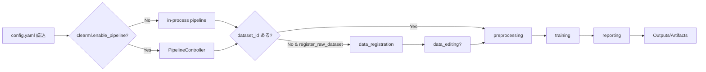
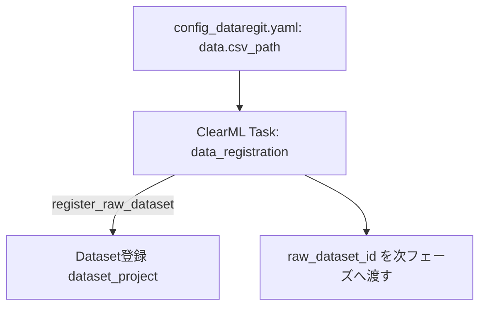
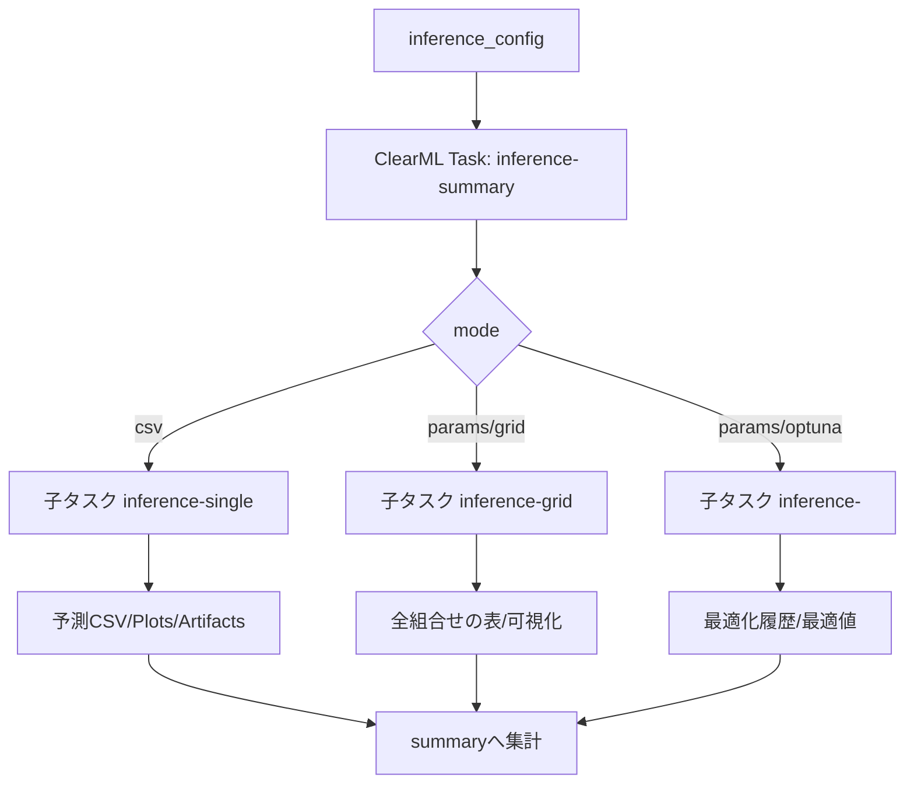
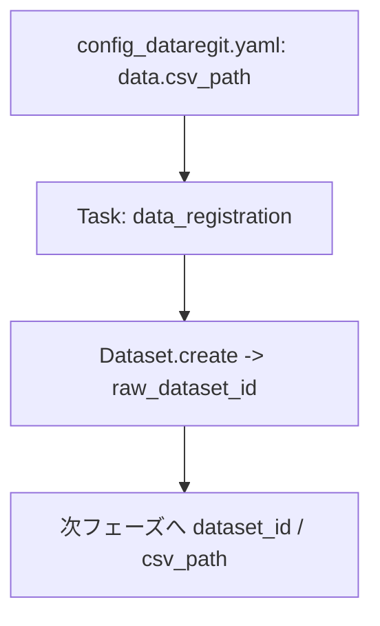
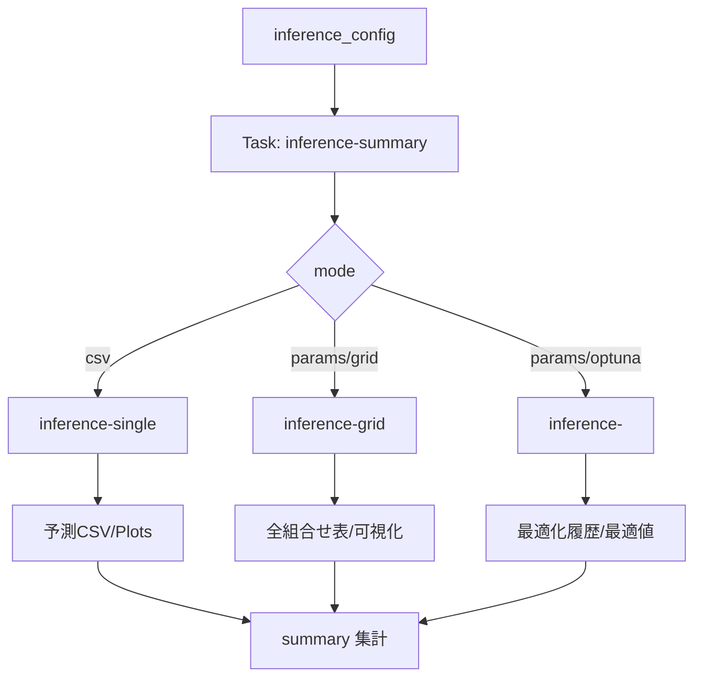
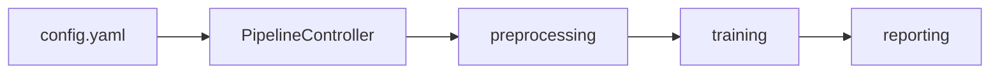

# README_user.md

本ドキュメントは、リファクタ後のAutoMLモジュールを利用する際の環境構築手順、フェーズ別の実行コマンド、設定パラメータの意味、ClearMLとの連携方法をまとめた利用者向けガイドです。  
本リポジトリは新CLI（`automl_lib/cli`）を前提とします（旧 `train.py` / `inference.py` は同梱しません）。

---

## 1. 環境構築

### 前提
- Python 3.10+ 推奨
- ClearML サーバが起動済み（ローカル: http://localhost:8080 など）
- Docker/Colima を利用する場合はデーモンが起動していること

### セットアップ手順
```bash
python3 -m venv .venv
source .venv/bin/activate
pip install -r requirements.txt
# 任意（Optuna/SHAP/LightGBM/TabPFN など）
pip install -r requirements-optional.txt
# ClearML を使う場合は設定ファイルを用意
cp clearml.conf.example clearml.conf
```

### ClearML 設定の確認
- `clearml.conf.example` を `clearml.conf` にコピーし、`web_server` / `api_server` / `files_server` と認証情報を設定
- `config.yaml` の `clearml` セクションでプロジェクト名/キュー名を指定（例は後述）

---

## 2. 実行コマンド一覧

### 新CLI（automl_lib / フェーズ単独実行、ClearMLタスク再利用防止・設定バリデーション付き）
- パイプライン（ClearML PipelineController優先、失敗時 in-process）  
  `python -m automl_lib.cli.run_pipeline --config config.yaml --output-info outputs/pipeline_info.json`
  - 明示的に in-process 実行する場合: `python -m automl_lib.cli.run_pipeline --config config.yaml --mode in_process`
  - 任意: pipeline 前段で `data_registration` / `data_editing` の設定YAMLを指定する場合:
    - `--datareg-config config_dataregit.yaml`
    - `--editing-config config_editing.yaml`
  - 任意: pipeline の preprocessing / （embedded比較のランキング設定）の設定YAMLを指定する場合:
    - `--preproc-config config_preprocessing.yaml`
    - `--comparison-config config_comparison.yaml`
- データ登録のみ（重複チェック: CSVハッシュ）  
  `python -m automl_lib.cli.run_data_registration --config config_dataregit.yaml`
- データ編集のみ（重複チェック: 編集後CSVハッシュ）  
  `python -m automl_lib.cli.run_data_editing --config config_editing.yaml`
- 前処理のみ  
  `python -m automl_lib.cli.run_preprocessing --config config_preprocessing.yaml`
- 学習フェーズのみ  
  `python -m automl_lib.cli.run_training --config config_training.yaml`
- レポートのみ（データ/前処理/推奨モデル/Top5意思決定表を集約。再生成したい場合）  
  `python -m automl_lib.cli.run_reporting --config config.yaml --run-id <run_id>`
  - task_id を直接指定したい場合: `--preprocessing-task-id <id>` / `--training-task-id <id>`
- 比較フェーズのみ（各学習タスクIDの集計・Plotly可視化を実行）  
  `python -m automl_lib.cli.run_comparison --config config_comparison.yaml --training-info training_info.json`
  - 複数runを横断比較する場合（repeatable）:
    - `--training-info outputs/run1/training_info.json --training-info outputs/run2/training_info.json`
- 推論フェーズのみ  
  `python -m automl_lib.cli.run_inference --config inference_config.yaml`

※ 全CLIで実行前に pydantic による設定バリデーション、`CLEARML_TASK_ID` クリアを行い、毎回新規タスクを作成します（必要に応じて `--output-info` で結果JSONを保存可能）。  
※ `config.yaml` を `run_preprocessing` / `run_reporting` / `run_comparison` に渡しても動作します（必要キーだけ抽出してバリデーションします）。

---

## 3. 設定パラメータ（主要項目）

### 学習用 config.yaml（抜粋）
| セクション | キー | 説明 |
|------------|------|------|
| data | dataset_id | 入力ClearML Dataset ID（推奨。無い場合は前段で生成） |
| data | csv_path | 入力CSVパス（data_registration/editing用、またはフォールバック） |
| data | target_column | 目的変数列名 |
| data | feature_columns | 入力特徴量の列名リスト（省略時は目的変数以外すべて） |
| data | test_size | ホールドアウト割合 (0〜1未満) |
| clearml | enabled | ClearML連携を有効にするか |
| clearml | project_name | 学習タスクのプロジェクト名 |
| clearml | dataset_project | Dataset登録先プロジェクト名 |
| clearml | register_raw_dataset | pipeline 前段で CSV -> Dataset 登録を行う（`config_dataregit.yaml` を利用） |
| clearml | enable_data_editing | pipeline 前段で Dataset/CSV -> 編集 -> Dataset 登録を行う（`config_editing.yaml` を利用） |
| clearml | queue | 実行キュー名（未指定ならローカル実行） |
| clearml | services_queue | パイプラインコントローラ用キュー（任意） |
| clearml | enable_pipeline | PipelineControllerを使うか |
| clearml | run_pipeline_locally | Trueならローカルでパイプライン実行 |
| clearml | comparison_mode | 比較の集約方式（`disabled` / `embedded` 推奨。※pipelineは比較タスクを作らず reporting タスクを作ります） |
| clearml | summary_plots | training-summary へ転送する画像（`none` / `best` / `all`） |
| clearml | recommendation_mode | 推奨モデルの選び方（`auto` / `training` / `comparison`） |
| reporting | top_k / include_tradeoff_plots | レポートのTopKと意思決定用trade-off可視化 |
| preprocessing | numeric_imputation / categorical_imputation / scaling / categorical_encoding | 前処理戦略 |
| models | name / params | 使用モデル名とハイパラ（複数可） |
| cross_validation | n_folds / shuffle / random_seed | CV設定 |
| output | output_dir / save_models | 出力先とモデル保存可否 |

補足:

- data_editing の出力は `outputs/data_editing/<run_id>`（デフォルト。`editing.output_dir`/`editing.output_filename` で変更可。`editing.output_path` 指定時はそちら優先）
- preprocessing の出力は `outputs/preprocessing/<run_id>`（デフォルト）
- training の出力は `outputs/train/<run_id>`（デフォルト）
- reporting の出力は `outputs/reporting/<run_id>`（デフォルト）
- `config_comparison.yaml` のランキング/複合スコアは `clearml.comparison_mode: embedded` の場合に training-summary/reporting の集約内容に反映されます（例: `primary_metric=composite_score`, `composite.weights`）
- 互換維持のため `clearml.enable_comparison` / `clearml.embed_comparison_in_training_summary` も動作しますが、今後は `clearml.comparison_mode` を推奨します

### 推論用 inference_config.yaml（抜粋）
| セクション | キー | 説明 |
|------------|------|------|
| model_dir | - | 学習済みモデルjoblibのディレクトリ |
| models | name, enable, model_id | 使用モデル（model_id指定時はClearML InputModelからロード） |
| clearml | enabled, project_name, task_name, queue | 推論タスク作成用のClearML設定 |
| input | mode | `csv` または `params` (範囲探索/最適化) |
| input | variables / params_path | paramsモード時の変数定義またはJSONパス |
| search | method | grid/random/tpe/cmaes |
| search | n_trials | 最適化試行数 |
| search | goal | min/max |
| output_dir | - | 推論結果の出力ディレクトリ |

### 設定パラメータ詳細（学習・推論共通でよく触る項目）
| カテゴリ | キー | 用途/メモ |
|----------|------|-----------|
| data | dataset_id / csv_path | pipeline は dataset_id 必須。未指定時はcsv_pathを読み込む（主に data_registration/editing 用） |
| preprocessing | numeric_imputation, scaling, categorical_encoding | 候補をリストで並べると直積で検証される |
| models | name, enable, params | 1モデルにつき1エントリ。paramsはgrid/random/bayesianの探索空間 |
| optimization | method, n_iter | `grid`=全探索、`random`/`bayesian`=Optuna系探索 |
| evaluation | primary_metric | 最良モデルの決定指標。未指定時は regression=r2, classification=accuracy |
| clearml | enable_pipeline / comparison_mode | PipelineControllerの有効化 + 比較集約（`embedded`/`disabled`。`standalone`比較は手動実行） |
| clearml.agents | preprocessing/training/inference/pipeline | 各フェーズの実行キュー。未設定ならqueueを使用 |
| inference.input | mode | `csv`=一括推論、`params`=範囲探索/最適化 |
| inference.search | method/n_trials/goal | Optunaのサンプラーと目的方向 |

### フェーズ別 入出力/主要設定
| フェーズ | 主入力 | 主出力 | 主要設定キー |
|----------|--------|--------|--------------|
| データ登録 | data.csv_path / data.dataset_id | raw_dataset_id (ClearML) | clearml.register_raw_dataset |
| データ編集 | raw_dataset_id / CSV | edited_dataset_id / `outputs/data_editing/<run_id>/edited.csv` | editing.* |
| 前処理 | data.dataset_id (既存Dataset) | preprocessed_dataset_id / preprocessed_features.csv | preprocessing.* |
| 学習 | preprocessed_dataset_id or CSV | models/*.joblib, metrics/results_summary.csv, training tasks | models, optimization, evaluation, output.* |
| レポート | preprocessing + training 結果 | reporting task + `outputs/reporting/<run_id>/report.md` | reporting.*, clearml.enable_pipeline, clearml.comparison_mode(embedded), clearml.agents.reporting |
| 推論 | model_dir or InputModel IDs | 予測CSV/Plotly/Artifacts | inference.input/search/output_dir |
| パイプライン | config.yaml | PipelineController task（ClearML） | clearml.enable_pipeline, clearml.run_pipeline_locally, clearml.services_queue |

---

## 4. フローチャート（全体とフェーズ別）

### 全体パイプライン（概要）


### データ登録フェーズ


### データ編集フェーズ
```mermaid
flowchart TD
    A[config_editing.yaml: raw_dataset_id or CSV] --> B[ClearML Task: data_editing]
    B --> C[編集結果CSV書き出し]
    B --> D[Dataset登録 edited (任意)]
    B --> E[編集差分ログを Debug Samples/Artifacts]
    E --> F[edited_dataset_id を次へ]
```

### 前処理フェーズ
```mermaid
flowchart TD
    A[data.dataset_id (既存Dataset)] --> B[ClearML Task: preprocessing]
    B --> C[特徴量型判定 -> 前処理パイプライン生成]
    C --> D[変換後データセット(任意でDataset登録)]
    D --> E[preprocessed_dataset_id を学習へ渡す]
```

### 学習フェーズ（summary + per-model）
```mermaid
flowchart TD
    A[preprocessed_dataset_id or CSV] --> B[ClearML Task: training-summary]
    B --> C[各モデル・前処理組合せの評価]
    C --> D[子タスク train_<model> (train_models プロジェクト)]
    D --> E[メトリクス/プロット/モデル保存 (OutputModel/Artifact)]
    C --> F[summary集計 (Plots/Artifacts/Debug Samples)]
```

### 推論フェーズ（summary + child tasks）


### ClearML 上でのデータ/モデル受け渡し（IDの流れ）
```mermaid
flowchart LR
    raw_csv[data.csv_path] --> reg[Task: data_registration (任意)]
    reg --> ds_raw[Dataset: raw_dataset_id]
    ds_raw --> edit[Task: data_editing (任意)]
    edit --> ds_edit[Dataset: edited_dataset_id]
    ds_raw --> ds_in[Dataset: data.dataset_id (既存)]
    ds_edit --> ds_in
    ds_in --> pre[Task: preprocessing]
    pre --> ds_pre[Dataset: preprocessed_dataset_id]
    ds_pre --> train_task[Task: training-summary]
    train_task --> model_tasks[Task: train_<model>...]
    train_task --> report_task[Task: reporting (report)]
```

---

## 5. ClearML連携のポイント
- 各フェーズ開始時に `CLEARML_TASK_ID` をクリアし、毎回新規タスクを作成（タスク再利用による停止を防止）。
- 親子タスク:
  - データ登録/編集/前処理/学習は順次親子リンクを設定（`AUTO_ML_PARENT_TASK_ID` or init_task）。
  - 学習では summary 親タスク + 各モデル子タスク（`<parent_project>/train_models`）。
  - 推論では summary 親タスク + single/grid/optuna 子タスク。
- Dataset登録:
  - raw/edited/preprocessed で必要に応じて Dataset を作成し、次フェーズへ dataset_id を渡す。
- モデル登録:
  - 学習フェーズで OutputModel として登録、推論では InputModel (model_id) を指定するとレジストリからロード。
- training-summary の推奨モデル:
  - `recommended_model.csv` と `recommendation_rationale.{md,json}` を出力し、ClearML の `01_overview/*` に表示します。
- reporting（レポート）:
  - `outputs/reporting/<run_id>/report.md` を生成し、データ/前処理/推奨モデル/Top5意思決定表を1タスクにまとめます。
- キュー/サービスキュー:
  - `queue` で通常タスクの実行先、`services_queue` で PipelineController をサービスキューに乗せる設定が可能。
- ログノイズ抑制:
  - 証明書無効警告などはデフォルトで抑制しています。戻したい場合は `AUTO_ML_SUPPRESS_WARNINGS=0` を設定してください。

---

## 6. よく使う設定例

### ClearML付きパイプライン例（config.yaml 抜粋）
```yaml
clearml:
  enabled: true
  project_name: "AutoML-with-ClearML"
  dataset_project: "AutoML-datasets"
  queue: "default"
  services_queue: "services"
  enable_pipeline: true
  run_pipeline_locally: false
  # comparison_mode: disabled | embedded
  # - embedded: training-summary/reporting に TopK/集計/ヒートマップ等を集約（推奨）
  # - standalone 比較タスクは pipeline では作りません（必要なら run_comparison を手動実行）
  comparison_mode: "embedded"
  summary_plots: "best"
  run_tasks_locally: false
  agents:
    data_registration: "default"
    data_editing: "default"
    preprocessing: "default"
    training: "default"
    reporting: "default"
    pipeline: "services"

reporting:
  top_k: 5
  include_tradeoff_plots: true
  include_task_links: true
```

### 推論でClearMLモデルを使う例（inference_config.yaml 抜粋）
```yaml
models:
  - name: Ridge
    enable: true
    model_id: "clearml-model-id-123"  # InputModelからロード
  - name: RandomForest
    enable: true
    # model_id未指定の場合は model_dir の joblib を利用
```

---

## 7. トラブルシュート
- タスクが再利用される/止まる: 各CLIで `CLEARML_TASK_ID` をクリア済みか確認。キューが存在するかも確認。
- PipelineControllerが出ない: `clearml.enable_pipeline: true` か、services_queue/queueが正しく設定されているか確認。ログの `[PipelineController]` 出力を参照。
- Datasetが学習プロジェクトに紐づく: `clearml.dataset_project` を明示設定する。
- ClearMLサーバ未接続: clearml.conf のURLとサーバ起動状態を確認（docker ps / curl http://localhost:8080 など）。

---

## 8. 開発エンジニア向け：追加実装/改修の指針

### フェーズ共通の入出力仕様
- 入力: `config.yaml`（学習） / `inference_config.yaml`（推論）。ClearMLが有効な場合は dataset_id / model_id を引き回す。
- 出力: フェーズごとのタスク（ClearML Task）、Artifacts（CSV/モデル）、Plots（主要グラフ）、Hyperparameters（connect_params でカテゴリ別）。
- タスク再利用防止: フェーズ開始前に `CLEARML_TASK_ID` をクリア。親子リンクは `init_task`/`create_child_task` で明示。

### フェーズ別の入出力と改修ポイント

| フェーズ | 入力 | 出力 | 主な処理 | 追加/修正すべき箇所 |
|----------|------|------|----------|----------------------|
| データ登録 | csv_path (config) | raw_dataset_id, Task | CSVをDataset登録 | 前処理前に新しいフォーマット/検証を入れたい場合はここで実装 |
| データ編集 | raw_dataset_id or CSV | edited_dataset_id, Task | 列削除/置換/フィルタ等 | 新しい編集ルールを追加する場合は editing 設定と処理を拡張 |
| 前処理 | edited_dataset_id or raw | preprocessed_dataset_id, Task | 特徴量型判定→前処理Pipeline生成→transform | 前処理ステップは registry 方式で追加/差し替えやすくする |
| 学習 | preprocessed_dataset_id or CSV | training-summary Task + per-model Tasks + OutputModel/Artifacts | CV評価・メトリクス記録・モデル保存 | モデル/ハイパラは registry に追加。Plots/Artifactsは指定の形式に統一 |
| レポート | 前処理+学習の結果 | reporting Task + report.md | データ/前処理/推奨モデル/Top5意思決定表を集約 | レポートの見せ方（表/Markdown/リンク）をここで改善 |
| 推論 | InputModel (model_id) or model_dir joblib | inference-summary Task + 子タスク (single/grid/optuna) | CSV/範囲探索/最適化 → 予測、最適値探索 | 新しい最適化アルゴリズムや指標を追加するときは inference の search 部分に拡張 |
| 比較（手動） | 複数 training タスクID | comparison Task | 指標集計・ランキング・best抽出・可視化 | 横断比較（複数run）用途。pipelineでは不要 |
| パイプライン | config.yaml | Pipeline Controller Task | 各フェーズをキュー実行 | 新フェーズ追加時は PipelineController にステップを追加 |

### Pipeline／設定変数（表）

| カテゴリ | 変数 | 用途 |
|----------|------|------|
| clearml | enabled | ClearML連携ON/OFF |
| clearml | project_name | タスクが属するプロジェクト |
| clearml | dataset_project | Dataset登録先プロジェクト |
| clearml | queue | 通常タスクのキュー |
| clearml | services_queue | Pipeline Controller用キュー |
| clearml | enable_pipeline | PipelineControllerを使うか |
| clearml | run_pipeline_locally | ローカルでパイプラインを動かすか |
| clearml | comparison_mode | 比較の集約方式（`disabled`/`embedded`。`standalone`比較は手動run_comparison） |
| clearml | summary_plots | training-summary へ転送する画像（none/best/all） |
| clearml.agents | data_registration/data_editing/preprocessing/training/reporting/inference/pipeline | 各ステップの実行キュー（未設定なら clearml.queue） |
| preprocessing | numeric_imputation / categorical_imputation / scaling / encoding | 前処理手法の選択 |
| models | name / params | 使用するモデルとパラメータ |
| cross_validation | n_folds / shuffle | CV設定 |
| inference.input | mode (csv/params/optuna) | 推論モード |
| inference.search | method / n_trials / goal | 範囲探索・最適化のアルゴリズムと目的 |

---

## 9. 各フェーズの処理フロー（Mermaid）

### データ登録


### データ編集
```mermaid
flowchart TD
    A[config_editing.yaml: raw_dataset_id or CSV] --> B[Task: data_editing]
    B --> C[編集処理 (drop/rename/fill/query...)]
    C --> D[edited CSV / dataset_id]
    D --> E[差分ログを Debug Samples/Artifacts]
```

### 前処理
```mermaid
flowchart TD
    A[data.dataset_id (既存Dataset)] --> B[Task: preprocessing]
    B --> C[特徴量型判定 -> 前処理ステップ適用]
    C --> D[変換データ / dataset_id]
    D --> E[学習フェーズへ渡す]
```

### 学習（summary + per-model）
```mermaid
flowchart TD
    A[preprocessed_dataset_id or CSV] --> B[Task: training-summary]
    B --> C[モデル×前処理の評価 (CV)]
    C --> D[子タスク train_<model> (train_models プロジェクト)]
    D --> E[メトリクス/プロット/モデル保存(OutputModel/Artifact)]
    C --> F[summary 集計 (Plots/Artifacts/Debug Samples)]
```

### 推論（summary + child）


### 比較
```mermaid
flowchart TD
    A[trainingタスクID一覧] --> B[Task: comparison (manual)]
    B --> C[各タスクのR2/MSE/RMSE収集]
    C --> D[集計表/Plotlyで可視化]
    D --> E[Artifacts: metrics_summary.csv]
```

### パイプライン（Controller）


---

## 10. 追加開発の指針
- 前処理を増やす: `preprocessing.numeric_pipeline_steps` / `preprocessing.categorical_pipeline_steps` に registry 登録済みTransformerを追加して差し込み可能（独自追加は `preprocessing.plugins` で module import → `register_preprocessor()`）。
- モデルを増やす: `automl_lib/registry/models.py` に `register_model()` を追加し、`config.yaml: models[].name` に列挙すれば評価対象に入る。
- 評価指標を増やす: `automl_lib/registry/metrics.py` に `register_metric()` を追加し、`evaluation.plugins` 経由で読み込んで `evaluation.*_metrics` に列挙する。
- 推論アルゴリズムを拡張: inference.search に新しいmethodを追加し、Optunaサンプラーや独自探索を実装。
- パイプラインに新フェーズを追加: PipelineControllerにステップ追加、前後のデータ/ID受け渡しを規定し、mermaid図を更新。

### 前処理の差し込み例（PCA）
`automl_lib/registry/preprocessors.py` には `pca`, `quantile`, `standard`, `minmax`, `robust`, `onehot`, `ordinal` などが既定登録されています。

```yaml
preprocessing:
  # 独自Transformerを使う場合は plugins で import（import先で register_preprocessor() を呼ぶ）
  # plugins: ["automl_lib.plugins.example_preprocessors"]
  numeric_pipeline_steps:
    - name: pca
      params:
        n_components: 5
```

### 評価指標の差し込み例（custom metric）
`automl_lib/registry/metrics.py` には `r2`, `mae`, `mse`, `rmse`, `accuracy`, `f1_macro`, `roc_auc_ovr` などが既定登録されています。

```yaml
evaluation:
  # plugins で import（import先で register_metric() を呼ぶ）
  # plugins: ["automl_lib.plugins.example_metrics"]
  regression_metrics: ["mae", "rmse", "r2", "mape", "smape"]
  classification_metrics: ["accuracy", "f1_macro", "roc_auc_ovr"]
```

### 開発エンジニア向けチェックリスト（改修時に見る場所）
| 目的 | 主なコード/設定 | 備考 |
|------|-----------------|------|
| 前処理を追加/変更 | automl_lib/preprocessing/preprocessors.py, automl_lib/registry/preprocessors.py, config.yaml: preprocessing | `*_pipeline_steps` + registry で差し込み可能 |
| モデルを追加/既存調整 | automl_lib/registry/models.py, config.yaml: models | 新モデル/エイリアス登録はここ（探索空間は config.yaml: models[].params） |
| HPO戦略を追加 | automl_lib/training/search.py, config.yaml: optimization.method | Optunaサンプラを増やす場合は依存パッケージも追記 |
| 指標を追加/変更 | automl_lib/registry/metrics.py, config.yaml: evaluation | `evaluation.plugins` で外部moduleから登録可（rmseはmse由来のderived指標） |
| ClearML連携調整 | automl_lib/clearml/*, automl_lib/training/clearml_integration.py, config.yaml: clearml.* | Task/Queue/Agent/Dataset の指定をここで共通化 |
| 推論挙動を拡張 | automl_lib/inference/*, inference_config.yaml | 入力モードや検索アルゴリズムを追加する場合はここを更新 |
| レポート拡張 | automl_lib/phases/reporting/* | 表/Markdown/リンク/意思決定用要約を追加 |
| 比較フェーズ拡張（任意） | automl_lib/phases/comparison/* | 複数run横断の集計や可視化を追加 |
| 設定バリデーション | automl_lib/config/schemas.py, automl_lib/config/loaders.py | 不明キーはエラー（typo検知） |
| ドキュメント更新 | README_user.md, README.md | コマンド例・Mermaid・設定表を同期する |

### 実行前の動作確認（推奨）
- 小さなデータで `python -m automl_lib.cli.run_training --config config.yaml` を実行し、`outputs/train` に結果が出ることを確認
- ClearMLなしで `clearml.enabled: false` にした時も通るかチェック
- ClearMLありの場合は `CLEARML_TASK_ID` が毎回クリアされているかログを確認
- 比較フェーズのみ動かす場合は `python -m automl_lib.cli.run_training --config config.yaml --output-info training_info.json` → `python -m automl_lib.cli.run_comparison --config config.yaml --training-info training_info.json` で確認
